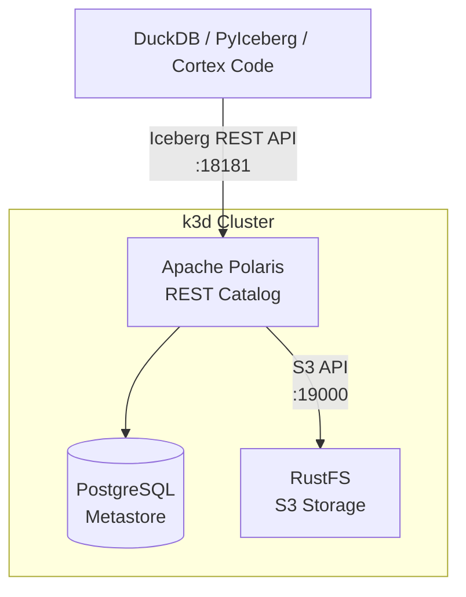
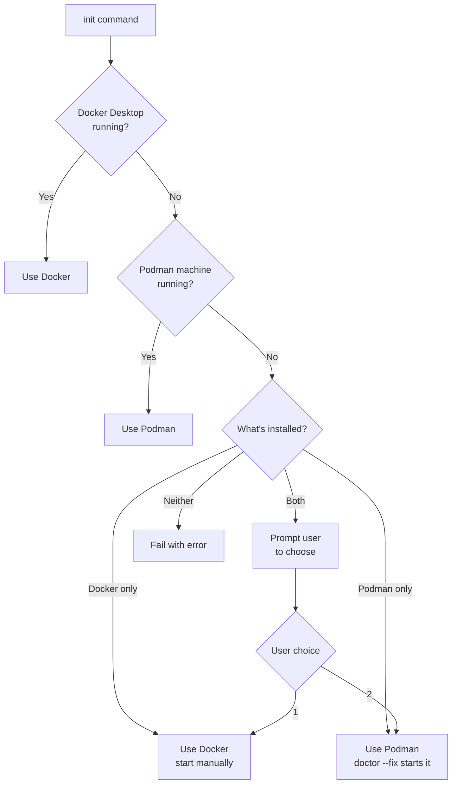

# Apache Polaris Local Forge


A complete local development environment for [Apache Polaris](https://polaris.apache.org/) with [RustFS](https://rustfs.com/) S3-compatible storage running on k3s Kubernetes.

**Why polaris-local-forge?**

- **Quickly try Apache Iceberg** — Get hands-on with Iceberg tables via Apache Polaris in minutes
- **Production blueprint** — K8s manifests and Helm patterns transfer directly to real clusters
- **Rinse-repeat PoC cycles** — Isolated `WORK_DIR` environments for easy setup/teardown/reset
- **K8s over Compose** — Production parity without "works locally, breaks in K8s" surprises

### Architecture



## Prerequisites

### Required Tools

> [!NOTE]
> **Windows users:** Use WSL2 with Ubuntu. All commands below work in WSL2.

| Tool | macOS | Linux | Docs |
|------|-------|-------|------|
| Podman (default) | `brew install podman` | `sudo dnf install podman` or `sudo apt install podman` | [podman.io](https://podman.io/getting-started) |
| Docker (alternative) | [Docker Desktop](https://www.docker.com/products/docker-desktop/) | [Docker Engine](https://docs.docker.com/engine/install/) | [docs.docker.com](https://docs.docker.com/) |
| k3d | `brew install k3d` | `curl -s https://raw.githubusercontent.com/k3d-io/k3d/main/install.sh \| bash` | [k3d.io](https://k3d.io/#installation) |
| Python | `brew install python@3.12` | `sudo apt install python3.12` | [python.org](https://www.python.org/downloads/) |
| uv | `curl -LsSf https://astral.sh/uv/install.sh \| sh` | Same | [docs.astral.sh/uv](https://docs.astral.sh/uv/) |
| Task | `brew install go-task` | `sh -c "$(curl --location https://taskfile.dev/install.sh)" -- -d` | [taskfile.dev](https://taskfile.dev/installation/) |

### Optional Tools

| Tool | Purpose | Install |
|------|---------|---------|
| DuckDB CLI | SQL verification | `brew install duckdb` (macOS) or [duckdb.org](https://duckdb.org/docs/installation/) |
| direnv | Auto-load env vars | `brew install direnv` (macOS) or [direnv.net](https://direnv.net/docs/installation.html) |

### Verify Prerequisites

```bash
# Quick health check
task doctor

# Or manually verify
podman --version  # or: docker --version
k3d version
python3 --version
uv --version
task --version
```

## Getting Started

Choose your path:

### Option 1: CLI

```bash
git clone https://github.com/kameshsampath/polaris-local-forge
cd polaris-local-forge
task setup:python

# Recommended: Use a separate work directory to keep source clean
mkdir -p ~/polaris-dev && task setup:all WORK_DIR=~/polaris-dev
```

> [!NOTE]
>
> - **Podman:** Auto-detected and started via `doctor --fix`.
> - **Docker:** Start Docker Desktop first.

### Option 2: Cortex Code (AI-assisted)

[Snowflake Cortex Code](https://docs.snowflake.com/en/developer-guide/cortex-code/overview) automates setup through natural language.

```bash
cortex skill add https://github.com/kameshsampath/polaris-local-forge
```

Then just say:

| Say this... | What happens |
|-------------|--------------|
| *"get started with apache polaris"* | Full guided setup with cluster, storage, and catalog |

*(OR)*

Simply with `cortex` say ( will install skill and run the workflow):

```bash
get started with apache polaris using example manifest <https://github.com/Snowflake-Labs/polaris-local-forge/blob/main/example-manifests/polaris-local-forge-manifest.md>
```

See [SKILL_README.md](SKILL_README.md) for complete trigger list and API query examples.

## Services

After setup, services are available at:

| Service | URL | Credentials |
|---------|-----|-------------|
| Apache Polaris API | <http://localhost:18181> | See `k8s/polaris/.bootstrap-credentials.env` |
| RustFS S3 | <http://localhost:19000> | `admin` / `password` |
| RustFS Console | <http://localhost:19001> | `admin` / `password` |

## Verify Setup

```bash
# Check status
task status

# Verify with DuckDB SQL
task catalog:verify:sql

# Or use interactive DuckDB
task catalog:explore:sql

# Or run the Jupyter notebook
jupyter notebook notebooks/verify_polaris.ipynb
```

## Runtime Detection

The CLI **auto-detects** the container runtime during `init` based on what's actually running:



**Detection priority:**

1. Running runtime preferred over just installed
2. Docker preferred when both are running
3. User prompted when both installed but neither running

Override auto-detection by setting `PLF_CONTAINER_RUNTIME=docker` or `PLF_CONTAINER_RUNTIME=podman` in `.env`.

> [!TIP]
> **First-time Podman users:** See [docs/podman-setup.md](docs/podman-setup.md) for machine setup, cgroup configuration, and network creation.

## Task Commands

All operations are available via Task commands:

### Podman Setup (one-time)

| Command | Description |
|---------|-------------|
| `task podman:setup` | Full Podman setup (machine + cgroup + network + verify) |
| `task podman:setup:machine` | macOS: create dedicated `k3d` Podman machine (4 CPUs / 16GB) |
| `task podman:setup:cgroup` | Configure cgroup v2 delegation for rootless k3d |
| `task podman:setup:network` | Create DNS-enabled `k3d` network |
| `task podman:check` | Verify Podman machine is ready with sufficient resources |

### Setup & Teardown

| Command | Description |
|---------|-------------|
| `task setup:all WORK_DIR=/path` | Complete setup in specified directory (recommended) |
| `task setup:all` | Complete setup in current directory |
| `task teardown WORK_DIR=/path` | Teardown specific project directory |
| `task teardown` | Complete teardown (cleanup + delete cluster) |
| `task reset:all` | Teardown and setup fresh |

### Status & Config

| Command | Description |
|---------|-------------|
| `task doctor` | Check system prerequisites and health |
| `task doctor:json` | Prerequisites check with JSON output |
| `task status` | Show cluster and Apache Polaris status |
| `task status:detailed` | Detailed kubectl output |
| `task config` | Show current configuration |
| `task urls` | Display service URLs |

### Cluster Management

| Command | Description |
|---------|-------------|
| `task cluster:create` | Create k3d cluster |
| `task cluster:delete` | Delete cluster |
| `task cluster:bootstrap-check` | Wait for bootstrap deployments |
| `task cluster:polaris-check` | Wait for Apache Polaris deployment |
| `task cluster:reset` | Delete and recreate cluster |

### Apache Polaris Operations

| Command | Description |
|---------|-------------|
| `task polaris:deploy` | Deploy Apache Polaris to cluster |
| `task polaris:check` | Verify Apache Polaris deployment |
| `task polaris:reset` | Purge and re-bootstrap Apache Polaris |
| `task polaris:purge` | Purge Apache Polaris data |
| `task polaris:bootstrap` | Bootstrap Apache Polaris |

### Catalog Management

| Command | Description |
|---------|-------------|
| `task catalog:setup` | Setup demo catalog |
| `task catalog:cleanup` | Cleanup catalog resources |
| `task catalog:reset` | Cleanup and recreate catalog |
| `task catalog:list` | List catalogs |
| `task catalog:verify:sql` | Verify with DuckDB (non-interactive) |
| `task catalog:explore:sql` | Explore with DuckDB (interactive) |
| `task catalog:verify:duckdb` | Verify with Python DuckDB |
| `task catalog:generate-notebook` | Generate verification notebook |
| `task catalog:info` | Show catalog configuration |

### Version Management

| Command | Description |
|---------|-------------|
| `task bump:polaris` | Update Apache Polaris to latest Docker Hub version |
| `task bump:polaris:dry-run` | Preview Apache Polaris version update |
| `task bump:k3s` | Update K3S to latest Docker Hub version |
| `task bump:k3s:dry-run` | Preview K3S version update |

### Logs & Troubleshooting

| Command | Description |
|---------|-------------|
| `task logs:polaris` | Stream Apache Polaris logs |
| `task logs:postgresql` | Stream PostgreSQL logs |
| `task logs:rustfs` | Stream RustFS logs |
| `task logs:bootstrap` | View bootstrap job logs |
| `task logs:purge` | View purge job logs |
| `task troubleshoot:polaris` | Diagnose Apache Polaris issues |
| `task troubleshoot:postgresql` | Check PostgreSQL connectivity |
| `task troubleshoot:rustfs` | Verify RustFS connectivity |
| `task troubleshoot:events` | Show recent events |

## CLI Reference

The `polaris-local-forge` CLI provides programmatic control with JSON output support:

```bash
uv run polaris-local-forge --help
```

### Commands

| Command | Description |
|---------|-------------|
| `polaris-local-forge init` | Initialize project directory with .env and configuration |
| `polaris-local-forge init --runtime docker\|podman` | Initialize with explicit runtime (skips interactive prompt) |
| `polaris-local-forge doctor` | Check system prerequisites and health |
| `polaris-local-forge doctor --fix` | Auto-fix issues (create/start Podman machine, kill gvproxy) |
| `polaris-local-forge doctor --output json` | Prerequisites as JSON (for automation/skills) |
| `polaris-local-forge prepare` | Generate configuration files from templates |
| `polaris-local-forge teardown --yes` | Execute teardown (stops Podman by default on macOS) |
| `polaris-local-forge cluster create` | Create k3d cluster |
| `polaris-local-forge cluster delete --yes` | Delete cluster |
| `polaris-local-forge cluster status` | Cluster status |
| `polaris-local-forge cluster status --output json` | Cluster status as JSON |
| `polaris-local-forge polaris deploy` | Deploy Apache Polaris to cluster |
| `polaris-local-forge polaris bootstrap` | Run Apache Polaris bootstrap job |
| `polaris-local-forge polaris purge` | Delete Apache Polaris deployment |
| `polaris-local-forge catalog setup` | Configure Apache Polaris catalog |
| `polaris-local-forge catalog cleanup --yes` | Clean up catalog resources |
| `polaris-local-forge catalog verify-sql` | Run DuckDB verification |
| `polaris-local-forge runtime detect` | Detect and display container runtime |
| `polaris-local-forge runtime detect --json` | Detection result as JSON (for agents) |
| `polaris-local-forge runtime docker-host` | Output DOCKER_HOST for current runtime |

All destructive commands support `--dry-run` to preview and `--yes` to skip confirmation.

## Configuration

Configuration is managed via `.env` file. Copy the example and customize:

```bash
cp .env.example .env
```

Key settings:

| Variable | Default | Description |
|----------|---------|-------------|
| `PLF_CONTAINER_RUNTIME` | (auto-detect) | `podman` or `docker`; auto-detected during `init` based on what's running |
| `PLF_PODMAN_MACHINE` | `k3d` | Podman machine name (macOS only) |
| `K3D_CLUSTER_NAME` | `polaris-local-forge` | Cluster name |
| `K3S_VERSION` | `v1.31.5-k3s1` | K3S version |
| `AWS_ENDPOINT_URL` | `http://localhost:19000` | RustFS S3 endpoint |
| `POLARIS_URL` | `http://localhost:18181` | Apache Polaris API endpoint |

> [!NOTE]
> `PLF_CONTAINER_RUNTIME` is auto-detected during `init`. It prefers running runtimes over installed ones.
> Set it manually in `.env` only to override auto-detection.

View current configuration:

```bash
task config
# or
uv run polaris-local-forge config
```

## Troubleshooting

### Quick Diagnostics

```bash
task status              # Check deployment status
task troubleshoot:events # View recent events
task logs:polaris        # Stream Apache Polaris logs
```

### Common Issues

> [!WARNING]
> **Apache Polaris pod stuck in ContainerCreating**
>
> ```bash
> kubectl get events -n polaris --sort-by='.lastTimestamp'
> task polaris:deploy  # Re-apply deployment
> ```

> [!WARNING]
> **RustFS not accessible**
>
> ```bash
> kubectl get pods -n rustfs
> task troubleshoot:rustfs
> ```

> [!WARNING]
> **Bootstrap job fails**
>
> ```bash
> task logs:bootstrap
> task polaris:reset  # Reset Apache Polaris
> ```

> [!CAUTION]
> **Port 19000 blocked by gvproxy (Podman)**
>
> When using Podman, the `gvproxy` network proxy may occupy port 19000 (needed by RustFS).
> This happens when a previous Podman machine session didn't clean up properly.
>
> ```bash
> # Option 1: Let doctor fix it (recommended)
> task doctor -- --fix
>
> # Option 2: Stop the Podman machine
> podman machine stop k3d
>
> # Option 3: Switch to Docker
> # Edit .env and set PLF_CONTAINER_RUNTIME=docker
> ```

### Manual kubectl Commands

```bash
kubectl get all -n polaris
kubectl get all -n rustfs
kubectl logs -f -n polaris deployment/polaris
kubectl describe pod -n polaris -l app=polaris
```

## Cleanup

```bash
# Cleanup catalog only (keep cluster)
task catalog:cleanup

# Reset catalog (cleanup + setup)
task catalog:reset

# Complete teardown (prompts to stop Podman machine on macOS)
task teardown WORK_DIR=~/polaris-dev

# Or just delete cluster (prompts to stop Podman machine on macOS)
task clean:all

# Delete cluster and stop Podman machine without prompts
polaris-local-forge cluster delete --yes --stop-podman
```

## Development

### Isolated Testing

For development and testing without polluting the source tree, use isolated test environments:

```bash
# Create an isolated test environment in /tmp
task test:isolated

# This creates /tmp/plf-test-<pid>/ with:
# - Symlinked Taskfile.yml pointing to source
# - Fresh .env with auto-detected runtime
# - Isolated .kube/, k8s/, work/ directories

# Run full setup in the isolated environment
cd /tmp/plf-test-*
task setup:all

# Clean up all isolated test folders
task test:isolated:clean

# List existing test folders
task test:isolated:list
```

The isolated environment protects the source directory from accidental initialization. Commands like `init`, `doctor`, `prepare`, and `cluster create` will refuse to run in the source directory without `--work-dir`.

## Related Projects

- [Apache Polaris](https://polaris.apache.org/) - Iceberg REST Catalog
- [Apache Iceberg](https://iceberg.apache.org/) - Open table format
- [RustFS](https://rustfs.com/) - S3-compatible object storage
- [k3d](https://k3d.io/) - k3s in Docker
- [PyIceberg](https://py.iceberg.apache.org/) - Python Iceberg library
- [DuckDB](https://duckdb.org/) - In-process SQL database

## Acknowledgments

Thanks to the contributors and reviewers who provided feedback, testing, and ideas that helped shape this project.

## License

Copyright (c) Snowflake Inc. All rights reserved. Licensed under the Apache 2.0 license.

## Contributing

Contributions welcome! Please submit a Pull Request.
