# Polaris Local Forge -- CLI Design Document

> Generated from codebase analysis of `src/polaris_local_forge/` (21 files, ~5,910 lines).
> Last updated: 2026-02-26

---

## Table of Contents

1. [Module Dependency Graph](#module-dependency-graph)
2. [CLI Command Tree](#cli-command-tree)
3. [Sequence Diagrams](#sequence-diagrams)
   - [Full Setup Workflow](#1-full-setup-workflow)
   - [Setup Replay/Resume Orchestration](#2-setup-replayresume-orchestration)
   - [Teardown Workflow](#3-teardown-workflow)
   - [Manifest Init + Runtime Detection](#4-manifest-init--runtime-detection)
   - [API Query and Catalog Query Flows](#5-api-query-and-catalog-query-flows)
4. [Key Design Decisions](#key-design-decisions)
5. [L2C Migration](#l2c-migration)
   - [L2C Module Dependency Graph](#l2c-module-dependency-graph)
   - [L2C CLI Command Tree](#l2c-cli-command-tree)
   - [L2C Sequence Diagrams](#l2c-sequence-diagrams)
     - [Setup AWS](#6-l2c-setup-aws)
     - [Setup Snowflake](#7-l2c-setup-snowflake)
     - [Sync](#8-l2c-sync)
     - [Register](#9-l2c-register)
     - [Migrate Orchestrator](#10-l2c-migrate-orchestrator)
     - [Refresh](#11-l2c-refresh)
   - [L2C Workflow Diagrams](#l2c-workflow-diagrams)
     - [Happy Path](#happy-path)
     - [Iteration Loop](#iteration-loop)
     - [Recovery Flow](#recovery-flow)
     - [Clear vs Cleanup](#clear-vs-cleanup)
     - [Cleanup Order](#cleanup-order)
     - [Cortex Code Flow](#cortex-code-flow)
     - [Incremental Data Update (zero downtime)](#incremental-data-update-zero-downtime)
     - [Manual Refresh (legacy)](#manual-refresh-legacy)
     - [New Table Added](#new-table-added-to-existing-catalog)
     - [Mixed: Mutated Data + New Table](#mixed-mutated-data--new-table)
     - [Schema Evolution](#schema-evolution)
     - [When to Use clear](#when-to-use-clear)
     - [Known Gaps](#known-gaps)
     - [State Lifecycle](#state-lifecycle)
   - [L2C Key Design Decisions](#l2c-key-design-decisions)
   - [Edge Cases and Limitations](#edge-cases-and-limitations)

---

## Module Dependency Graph

Each Python module has a single responsibility. Shared utilities live in `common.py`;
container runtime abstraction lives in `container_runtime.py`. All other modules are
leaf command groups registered on the root Click group in `cli.py`.

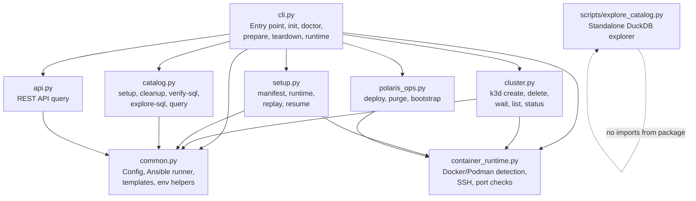

**Import rules:**
- `common.py` and `container_runtime.py` never import from other package modules.
- `cli.py` is the only module that registers command groups (`add_command`).
- `cluster.py` has one lazy import back to `cli.py` (`init_project`) inside `cluster_create()` to break a circular dependency.

---

## CLI Command Tree

All commands are accessed via the `polaris-local-forge` entry point (aliased as `plf` by the generated wrapper script).

```
plf [--work-dir PATH]
├── init                          # cli.py:init_project
│   ├── --force / -f
│   ├── --cluster-name / -n
│   ├── --with-manifest / -m
│   └── --runtime / -r [docker|podman]
├── doctor                        # cli.py:doctor
│   ├── --fix
│   └── --output [text|json]
├── prepare                       # cli.py:prepare
│   ├── --tags / -t
│   ├── --dry-run / -n
│   └── --verbose / -v
├── teardown                      # cli.py:teardown
│   ├── --dry-run / -n
│   ├── --yes / -y
│   └── --stop-podman / --no-stop-podman
├── runtime                       # cli.py (group)
│   ├── docker-host               # cli.py:runtime_docker_host
│   └── detect                    # cli.py:runtime_detect
│       └── --json
├── cluster                       # cluster.py (group)
│   ├── create                    # cluster.py:cluster_create
│   │   ├── --dry-run / -n
│   │   ├── --force / -f
│   │   ├── --wait-timeout INT
│   │   └── --skip-wait
│   ├── delete                    # cluster.py:cluster_delete
│   │   ├── --dry-run / -n
│   │   └── --yes / -y
│   ├── wait                      # cluster.py:cluster_wait
│   │   ├── --tags / -t
│   │   ├── --dry-run / -n
│   │   └── --verbose / -v
│   ├── list                      # cluster.py:cluster_list
│   │   └── --output [text|json]
│   └── status                    # cluster.py:cluster_status
│       └── --output [text|json]
├── polaris                       # polaris_ops.py (group)
│   ├── deploy                    # polaris_ops.py:polaris_deploy
│   │   └── --dry-run / -n
│   ├── purge                     # polaris_ops.py:polaris_purge
│   │   └── --dry-run / -n
│   └── bootstrap                 # polaris_ops.py:polaris_bootstrap
│       └── --dry-run / -n
├── catalog                       # catalog.py (group)
│   ├── setup                     # catalog.py:catalog_setup
│   │   ├── --tags / -t
│   │   ├── --dry-run / -n
│   │   └── --verbose / -v
│   ├── cleanup                   # catalog.py:catalog_cleanup
│   │   ├── --tags / -t
│   │   ├── --dry-run / -n
│   │   ├── --verbose / -v
│   │   └── --yes / -y
│   ├── verify-sql                # catalog.py:catalog_verify_sql
│   ├── explore-sql               # catalog.py:catalog_explore_sql
│   └── query                     # catalog.py:catalog_query
│       └── --sql / -s TEXT
├── api                           # api.py (group)
│   └── query ENDPOINT            # api.py:api_query
│       ├── --output [json|text]
│       └── --verbose / -v
└── setup                         # setup.py (group)
    ├── manifest                  # setup.py (subgroup)
    │   ├── init                  # setup.py:manifest_init
    │   │   └── --runtime [docker|podman]
    │   ├── status                # setup.py:manifest_status
    │   │   └── --json
    │   ├── update RESOURCE_NUM   # setup.py:manifest_update
    │   ├── start                 # setup.py:manifest_start
    │   ├── complete              # setup.py:manifest_complete
    │   └── remove                # setup.py:manifest_remove
    ├── runtime                   # setup.py (subgroup)
    │   ├── ensure                # setup.py:runtime_ensure
    │   └── stop                  # setup.py:runtime_stop
    ├── replay                    # setup.py:setup_replay
    └── resume                    # setup.py:setup_resume
```

**Total: 28 commands** across 7 modules.

---

## Sequence Diagrams

### 1. Full Setup Workflow

The canonical happy-path from a bare directory to a running Polaris environment.
Each `plf` command is a separate user invocation; the SKILL.md orchestration layer
(or Taskfile) calls them in sequence.

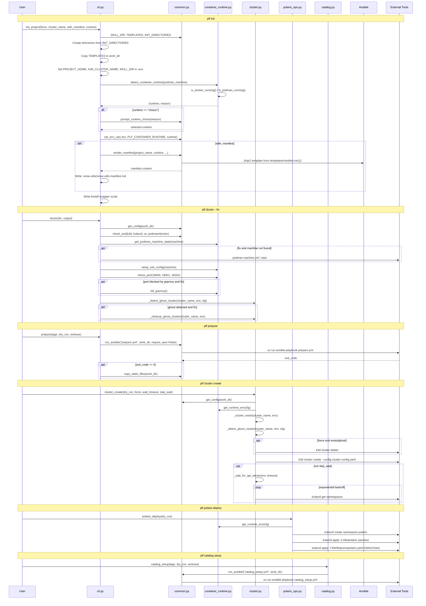

**Key observations:**

- `init` is self-contained: creates directories, copies templates, detects runtime, writes `.env`. No subprocess calls to external tools.
- `doctor` is the only command that attempts auto-remediation (`--fix`). It checks tools, Podman machine state, port availability, and ghost clusters.
- `prepare` delegates entirely to Ansible (`prepare.yml`) which generates k8s manifests, `.aws/config`, and SQL scripts from Jinja2 templates.
- `cluster create` does pre-flight validation (existing cluster, ghost cluster) before invoking `k3d`, then waits for the API server with exponential backoff.
- `polaris deploy` is a 3-step kubectl sequence: namespace, secrets (kustomize), HelmChart.
- `catalog setup` delegates to Ansible (`catalog_setup.yml`) which creates the Polaris catalog, namespaces, and demo data via the Polaris REST API.

### 2. Setup Replay/Resume Orchestration

The `setup replay` and `setup resume` commands provide idempotent setup.
`replay` inspects manifest state and returns an exit code; the caller (Taskfile)
decides whether to run `setup:all` (exit 10) or `setup:resume` (exit 11).
`resume` walks through resources 1-7, skipping any already marked DONE.

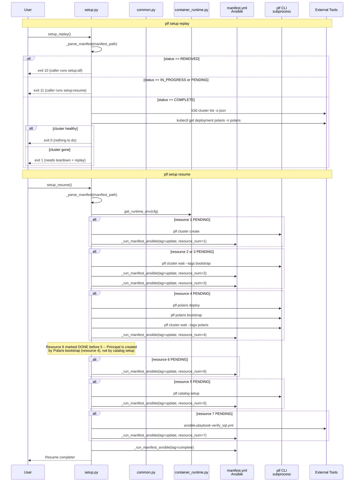

**Resource numbering:**

| # | Resource   | Created by          | Wait strategy             |
|---|-----------|---------------------|---------------------------|
| 1 | k3d cluster | `plf cluster create` | API server readiness loop |
| 2 | RustFS     | k3d volume mount    | `cluster wait --tags bootstrap` |
| 3 | PostgreSQL | k3d volume mount    | `cluster wait --tags bootstrap` |
| 4 | Polaris    | `plf polaris deploy` + `bootstrap` | `cluster wait --tags polaris` |
| 5 | Catalog    | `plf catalog setup` | Ansible playbook completes |
| 6 | Principal  | Polaris bootstrap job | Already done after resource 4 |
| 7 | Demo data  | `verify_sql.yml`    | Ansible playbook completes |

**Why resource 6 before 5:** The principal (OAuth2 client credentials) is created by the
Polaris bootstrap job (resource 4). By the time resource 4 is DONE, the principal already
exists. Resource 6 is simply a manifest bookkeeping step. Resource 5 (catalog setup) then
uses those credentials to configure namespaces and demo data.

### 3. Teardown Workflow

Teardown is intentionally simple: delete the k3d cluster (which wipes all in-cluster
state including RustFS, PostgreSQL, and Polaris), then optionally stop the Podman machine.

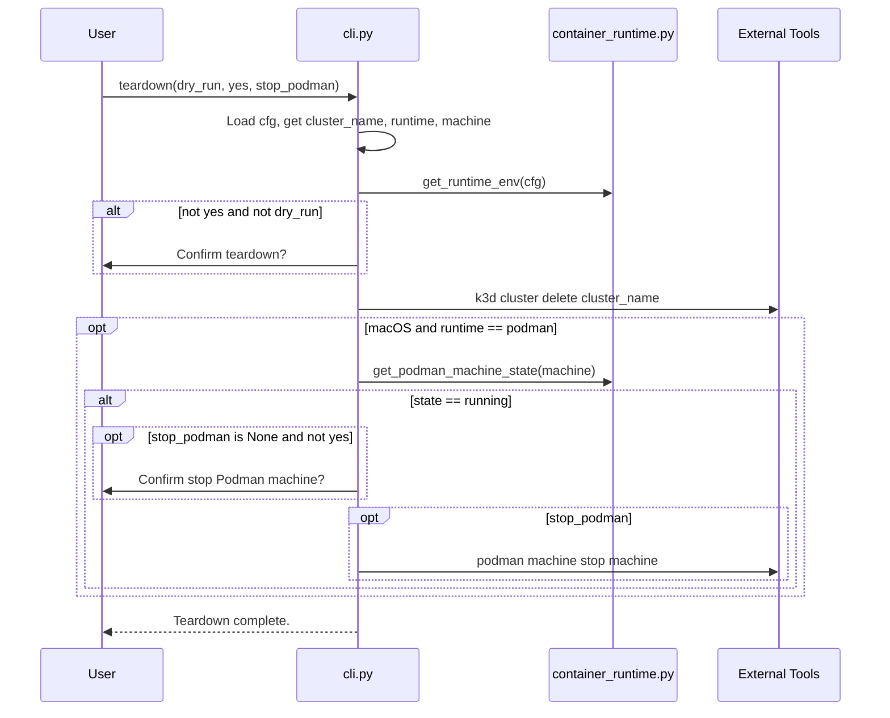

**Design note:** No explicit catalog cleanup is performed. The k3d cluster deletion
removes all containers, volumes, and networks associated with the cluster. This is
faster and more reliable than running cleanup playbooks against services that may be
in an inconsistent state.

### 4. Manifest Init + Runtime Detection

Runtime detection has a 3-tier priority: explicit `--runtime` flag, `.env` file,
environment variable, then auto-detection. The `_detect_runtime()` helper in `setup.py`
adds `.env` reading on top of the lower-level `detect_container_runtime()` from
`container_runtime.py`.

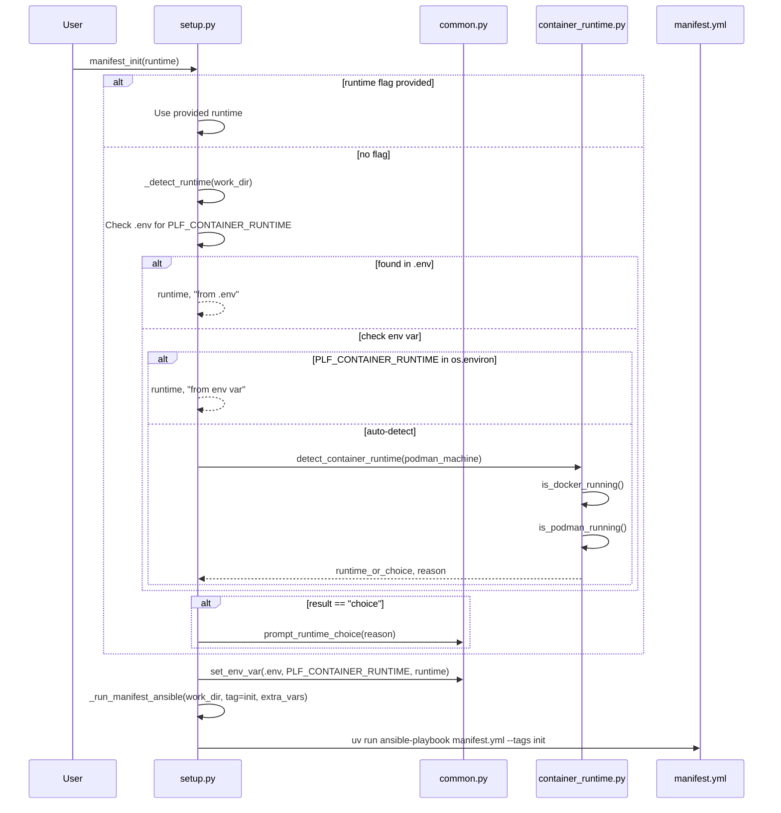

**Auto-detection logic in `detect_container_runtime()`:**

```
1. Docker running AND Podman running  ->  "docker" (prefer Docker)
2. Docker running only                ->  "docker"
3. Podman running only                ->  "podman"
4. Neither running, both installed    ->  "choice" (prompt user)
5. Neither running, one installed     ->  that one
6. Neither installed                  ->  None (error)
```

### 5. API Query and Catalog Query Flows

Two different query paths exist: `plf api query` goes through Ansible for REST API
calls, while `plf catalog query` invokes DuckDB directly for SQL against Iceberg tables.

```mermaid
sequenceDiagram
    participant User
    participant API as api.py
    participant Catalog as catalog.py
    participant Common as common.py
    participant Subprocess as External Tools

    Note over User,Subprocess: plf api query /api/management/v1/catalogs
    User->>API: api_query(endpoint, output, verbose)
    API->>API: Validate endpoint starts with /
    API->>API: Check work/principal.txt exists
    API->>Subprocess: uv run ansible-playbook api_query.yml -e endpoint=...
    alt verbose
        Subprocess-->>User: Raw Ansible output
    else
        API->>API: Regex extract "result.json" from stdout
        API->>API: Parse JSON
        alt output == json
            API-->>User: Pretty-printed JSON
        else
            API->>API: _print_text(data)
            API-->>User: Flattened key-value text
        end
    end

    Note over User,Subprocess: plf catalog query --sql "SELECT ..."
    User->>Catalog: catalog_query(sql)
    Catalog->>Catalog: load_dotenv(.env)
    Catalog->>Catalog: Parse work/principal.txt -> realm, client_id, client_secret
    Catalog->>Catalog: Build setup SQL: INSTALL iceberg, CREATE SECRET, ATTACH
    Catalog->>Subprocess: duckdb -c "setup_sql + user_sql;"
    Subprocess-->>User: Query results
```

**Why two query mechanisms:**

- `plf api query` is for Polaris REST API introspection (management endpoints, catalog
  metadata). It delegates to Ansible because the `api_query.yml` playbook handles OAuth2
  token acquisition and HTTP request construction.
- `plf catalog query` is for SQL-based data access against Iceberg tables. It uses DuckDB's
  native Iceberg extension which handles OAuth2 internally via the `CREATE SECRET` statement.

---

## Key Design Decisions

### 1. subprocess.run over Python libraries

The CLI uses `subprocess.run` for all external tool interaction (k3d, kubectl, podman,
duckdb, ansible-playbook) rather than Python client libraries.

**Rationale:**
- k3d has no Python SDK; kubectl has a Python client but it adds complexity for operations
  that are simpler as shell commands (apply -f, apply -k, create namespace).
- Ansible is invoked via `uv run ansible-playbook` to ensure dependency isolation --
  ansible and its plugins run in the uv-managed virtual environment.
- DuckDB CLI is used for `catalog query` / `verify-sql` / `explore-sql` because it
  provides a familiar interactive experience and handles extension loading automatically.

**Trade-off:** Error messages from failed subprocesses can be opaque. The CLI mitigates
this by capturing stderr and providing contextual error messages where possible.

### 2. Ansible for configuration and catalog operations

Template rendering (`prepare`), catalog setup/cleanup, and API queries are delegated
to Ansible playbooks rather than implemented in Python.

**Rationale:**
- Ansible's Jinja2 templating + variable layering (defaults, env vars, extra vars)
  provides a declarative configuration pipeline.
- `kubernetes.core` Ansible modules provide idempotent k8s resource management.
- The `uri` module in Ansible handles HTTP requests with retry/backoff for Polaris API
  calls during catalog setup.

**Trade-off:** Ansible adds startup latency (~2-3s per playbook invocation) and requires
users to have ansible installed as a dev dependency.

### 3. SKILL_DIR / work_dir split

The source code (SKILL_DIR) and the user's project directory (work_dir) are kept separate.

```
SKILL_DIR (source repo)              work_dir (user project)
├── src/polaris_local_forge/         ├── .env
├── polaris-forge-setup/             ├── .kube/config
│   ├── defaults/main.yml            ├── .aws/config
│   ├── templates/                   ├── k8s/
│   └── *.yml playbooks              ├── work/principal.txt
├── config/cluster-config.yaml       ├── scripts/explore_catalog.sql
└── k8s/ (static files)              └── bin/plf
```

**Rationale:**
- Users can have multiple project directories sharing the same SKILL_DIR.
- The source repo is never modified by CLI operations (read-only after install).
- `plf init` copies templates and static files from SKILL_DIR to work_dir.
- `run_ansible()` always passes `-e plf_output_base={work_dir}` to ensure Ansible
  writes generated files to the project directory, not the source directory.

**Guard:** `init_project()` and `doctor()` check `work_dir.resolve() == SKILL_DIR.resolve()`
and refuse to operate on the source directory.

### 4. Container runtime abstraction

The CLI supports both Docker and Podman as container runtimes. The abstraction layer
in `container_runtime.py` handles:

- **Detection:** Check what's installed and running, prompt if ambiguous.
- **DOCKER_HOST:** On macOS with Podman, k3d needs an SSH-based DOCKER_HOST pointing
  to the Podman VM (not the local Unix socket). `get_runtime_env()` sets this.
- **SSH config:** Podman VMs on macOS require SSH key configuration for k3d to
  communicate with the VM. `setup_ssh_config()` handles this.

The runtime choice is persisted to `.env` as `PLF_CONTAINER_RUNTIME` so subsequent
commands don't need to re-detect.

### 5. Manifest-driven orchestration

The `.snow-utils/snow-utils-manifest.md` file tracks setup progress as a markdown
document with a resource table. Each resource (1-7) has a status (PENDING/DONE).

**Rationale:**
- Human-readable: users can inspect progress by reading the file.
- Idempotent resume: `setup resume` checks each resource's status and skips completed ones.
- Cross-workflow: both the CLI (`plf setup`) and Taskfile (`task setup:all`) can read
  and update the same manifest.
- Ansible integration: `manifest.yml` playbook handles atomic updates to the markdown
  using regex replacements.

**Trade-off:** Regex-based markdown parsing is fragile. The `_parse_manifest()` function
relies on specific formatting patterns that could break if the template changes.

---

## L2C Migration (Experimental)

> **Note:** L2C is experimental. The migration workflow and Iceberg metadata
> rewriting approach are being validated with Apache Iceberg experts. APIs and
> behavior may change.

The L2C (Local to Cloud) subsystem migrates local Polaris PoC experiments to AWS S3
and registers them as Snowflake External Iceberg Tables. It lives under
`src/polaris_local_forge/l2c/` as a self-contained package (11 Python files, 9 SQL
templates, ~2,700 lines) and depends on two external libraries:
[snow-utils](https://github.com/kameshsampath/snow-utils) for AWS infrastructure and
[snow-utils-common](https://github.com/kameshsampath/snow-utils) for Snowflake CLI wrappers.

### L2C Module Dependency Graph

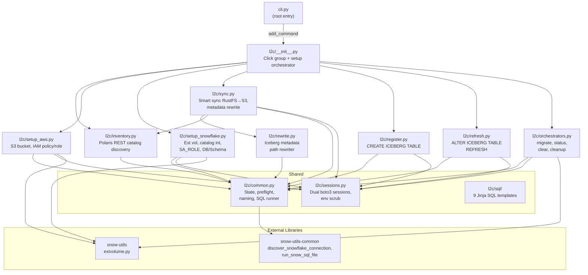

**Import rules:**

- `sessions.py` and `common.py` are the shared foundation; all command modules import from them.
- `sessions.py` never imports from any other L2C module.
- `common.py` imports only from `sessions.py` (for `_resolve_profile`).
- `rewrite.py` imports only from `common.py` (for `find_latest_metadata`).
- `refresh.py` imports only from `common.py` and `sessions.py`.
- `sync.py` imports from `inventory.py` (for `PolarisRestClient`, `_discover_tables`) and `rewrite.py`.

---

### L2C CLI Command Tree

```
plf l2c
├── inventory                        # inventory.py
│   └── --output / -o [text|json]
├── setup                            # __init__.py (orchestrator group)
│   ├── (no subcommand)              # runs aws → snowflake in sequence
│   │   ├── --dry-run / -n
│   │   └── --yes / -y
│   ├── aws                          # setup_aws.py
│   │   ├── --aws-profile            # envvar: L2C_AWS_PROFILE
│   │   ├── --region / -r            # envvar: L2C_AWS_REGION
│   │   ├── --prefix / -p TEXT
│   │   ├── --no-prefix
│   │   ├── --dry-run / -n
│   │   └── --yes / -y
│   └── snowflake                    # setup_snowflake.py
│       ├── --sf-database / -D       # envvar: L2C_SF_DATABASE
│       ├── --sf-schema / -S         # default: L2C
│       ├── --admin-role
│       ├── --prefix / -p TEXT
│       ├── --no-prefix
│       ├── --aws-profile
│       ├── --region / -r
│       ├── --dry-run / -n
│       └── --yes / -y
├── sync                             # sync.py
│   ├── --aws-profile
│   ├── --region / -r
│   ├── --prefix / -p TEXT
│   ├── --no-prefix
│   ├── --force / -f
│   ├── --skip-rewrite
│   ├── --dry-run / -n
│   └── --yes / -y
├── register                         # register.py
│   ├── --sf-database / -D
│   ├── --sf-schema / -S
│   ├── --prefix / -p TEXT
│   ├── --no-prefix
│   ├── --dry-run / -n
│   └── --yes / -y
├── refresh                          # refresh.py
│   ├── --aws-profile
│   ├── --sf-database / -D
│   ├── --sf-schema / -S
│   ├── --prefix / -p TEXT
│   ├── --no-prefix
│   ├── --dry-run / -n
│   └── --yes / -y
├── migrate                          # orchestrators.py
│   ├── --aws-profile
│   ├── --region / -r
│   ├── --sf-database / -D
│   ├── --sf-schema / -S
│   ├── --admin-role
│   ├── --prefix / -p TEXT
│   ├── --no-prefix
│   ├── --dry-run / -n
│   └── --yes / -y
├── status                           # orchestrators.py
│   └── --output / -o [text|json]
├── clear                            # orchestrators.py
│   ├── --aws-profile
│   ├── --prefix / -p TEXT
│   ├── --no-prefix
│   ├── --dry-run / -n
│   └── --yes / -y
└── cleanup                          # orchestrators.py
    ├── --aws-profile
    ├── --admin-role
    ├── --prefix / -p TEXT
    ├── --no-prefix
    ├── --force / -f
    ├── --dry-run / -n
    └── --yes / -y
```

**Total: 11 L2C commands** (inventory, setup, setup aws, setup snowflake, sync, register, refresh, migrate, status, clear, cleanup) across 7 modules + 9 SQL templates.

All mutating commands support `--dry-run` (preview) and `--yes` (skip confirmation) for both interactive CLI and non-interactive Cortex Code usage.

---

### L2C Sequence Diagrams

### 6. L2C Setup AWS

Creates S3 bucket, IAM policy, and IAM role for the migration. All resource names
are auto-derived from `<SNOWFLAKE_USER>-<project>-<catalog>`.

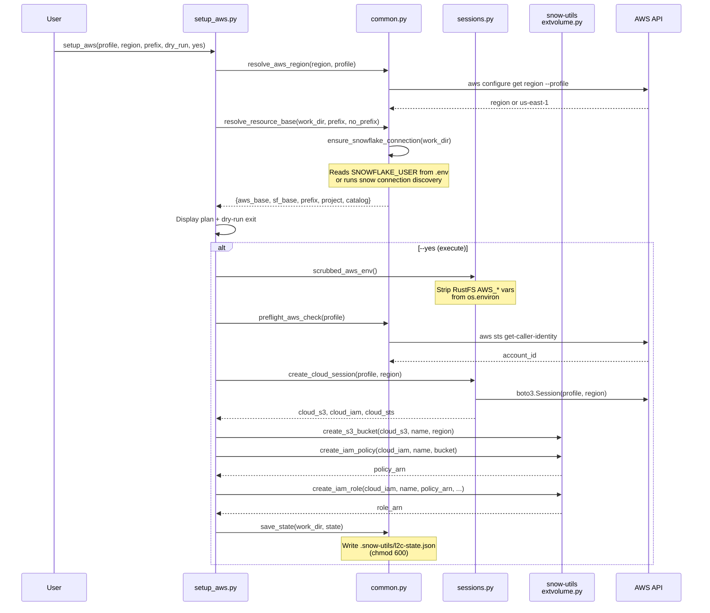

### 7. L2C Setup Snowflake

Creates catalog integration, external volume, SA_ROLE with least-privilege grants,
target DB/Schema, and updates the AWS trust policy with Snowflake's IAM user ARN.

```mermaid
sequenceDiagram
    participant User
    participant SetupSF as setup_snowflake.py
    participant Common as common.py
    participant Sessions as sessions.py
    participant SnowUtils as snow-utils<br/>extvolume.py
    participant SnowCLI as snow sql
    participant AWS as AWS API

    User->>SetupSF: setup_snowflake(database, schema, admin_role, ...)
    SetupSF->>Common: load_state(work_dir)
    Note over SetupSF: Requires aws state (bucket, role_arn, external_id)

    SetupSF->>Common: resolve_resource_base(work_dir)
    SetupSF->>SetupSF: _resolve_admin_role(admin_role, work_dir)
    Note over SetupSF: CLI flag > manifest > interactive prompt

    SetupSF->>SetupSF: Display plan + dry-run exit

    alt --yes (execute)
        SetupSF->>Common: run_l2c_sql_file("setup_catalog_integration.sql")
        Common->>SnowCLI: snow sql -f ... --enable-templating ALL
        Note over SnowCLI: USE ROLE admin_role;<br/>CREATE CATALOG INTEGRATION IF NOT EXISTS

        SetupSF->>SnowUtils: create_external_volume(config, role_arn)
        Note over SnowUtils: CREATE EXTERNAL VOLUME with<br/>S3 storage location + IAM role ARN

        SetupSF->>SnowUtils: describe_external_volume(volume_name)
        SnowUtils-->>SetupSF: snowflake_iam_arn, external_id

        SetupSF->>Sessions: scrubbed_aws_env()
        SetupSF->>Sessions: create_cloud_session(profile, region)
        SetupSF->>SnowUtils: update_role_trust_policy(iam, role, sf_arn, ext_id)
        Note over AWS: Update IAM role trust policy<br/>to allow Snowflake assume-role

        SetupSF->>Common: run_l2c_sql_file("setup_role.sql")
        Note over SnowCLI: CREATE ROLE, DB, SCHEMA<br/>GRANT USAGE, CREATE ICEBERG TABLE

        SetupSF->>SnowUtils: verify_external_volume(volume_name)
        SetupSF->>Common: save_state + _update_manifest
    end
```

### 8. L2C Sync

Smart-syncs Iceberg data from local RustFS to AWS S3, then rewrites metadata paths.

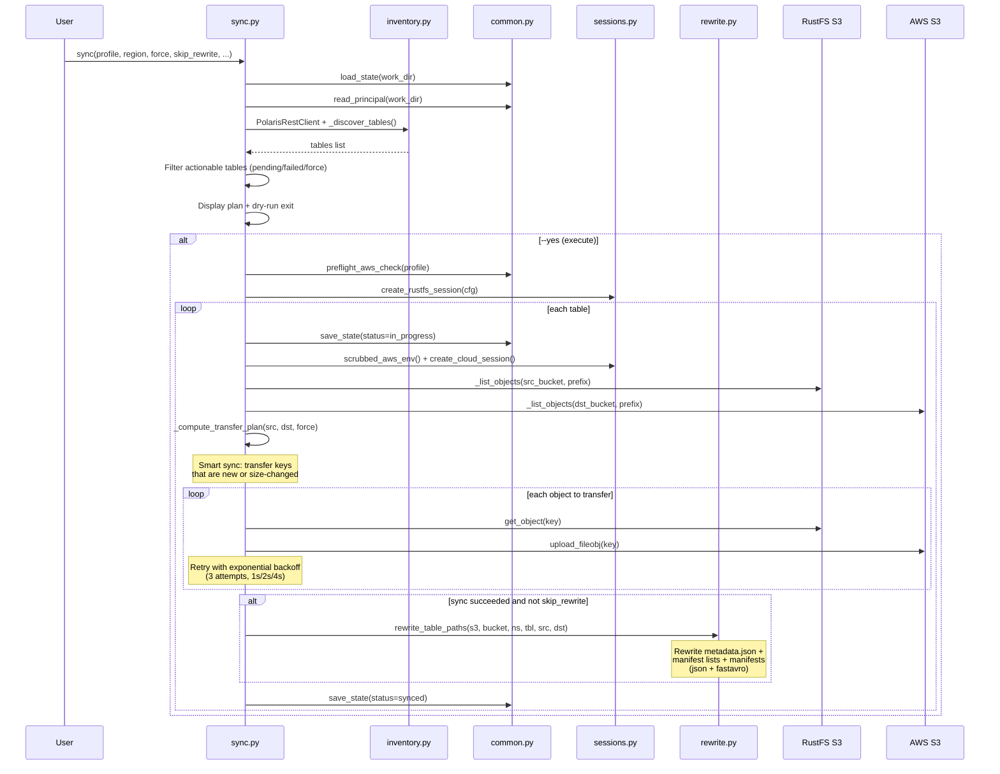

### 9. L2C Register

Creates Snowflake External Iceberg Tables for synced tables using catalog integration
and `METADATA_FILE_PATH` (schema inferred from Iceberg metadata).

```mermaid
sequenceDiagram
    participant User
    participant Register as register.py
    participant Common as common.py
    participant Sessions as sessions.py
    participant SnowCLI as snow sql
    participant AWS as AWS S3

    User->>Register: register(database, schema, ...)
    Register->>Common: load_state(work_dir)
    Note over Register: Requires aws + snowflake state

    Register->>Register: Filter tables with sync=synced, register!=done
    Register->>Register: Display plan + dry-run exit

    Register->>Sessions: scrubbed_aws_env() + create_cloud_session()

    loop each registerable table
        Register->>Common: find_latest_metadata(s3, bucket, ns, tbl)
        Note over AWS: Scan metadata/ for highest-numbered<br/>NNNNN-uuid.metadata.json

        alt dry-run
            Register->>Common: run_l2c_sql_file("register_table.sql", dry_run=True)
            Note over Register: Show rendered SQL
        else execute
            Register->>Common: run_l2c_sql_file("register_table.sql")
            Note over SnowCLI: USE ROLE sa_role;<br/>CREATE ICEBERG TABLE IF NOT EXISTS<br/>  EXTERNAL_VOLUME, CATALOG,<br/>  METADATA_FILE_PATH

            Register->>Common: save_state(register=done, sf_table=FQN)
        end
    end
```

### 10. L2C Migrate Orchestrator

Runs the complete pipeline in sequence. Each step is idempotent.

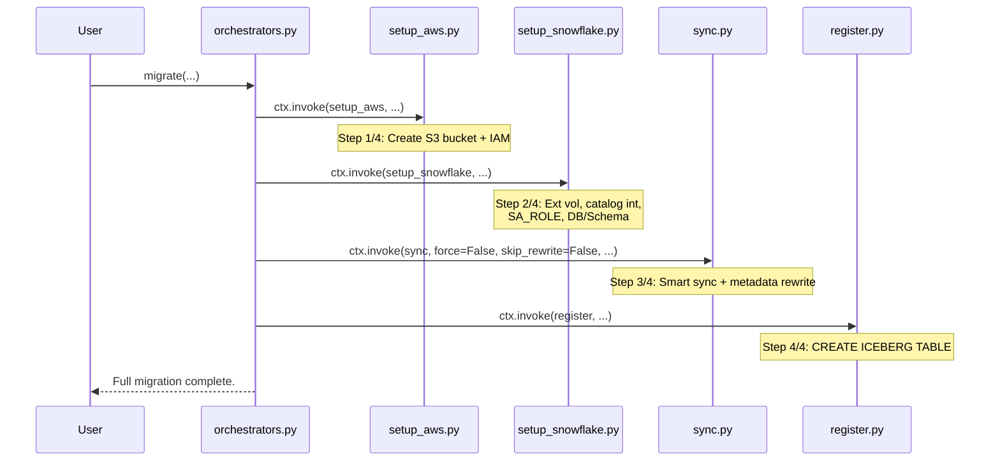

### 11. L2C Refresh

Updates the metadata pointer for already-registered Snowflake Iceberg tables.
Compares the stored `metadata_path` with the latest file on S3 and runs
`ALTER ICEBERG TABLE ... REFRESH` for any table with a newer snapshot.

```mermaid
sequenceDiagram
    participant User
    participant Refresh as refresh.py
    participant Common as common.py
    participant Sessions as sessions.py
    participant SnowCLI as snow sql
    participant AWS as AWS S3

    User->>Refresh: refresh(database, schema, ...)
    Refresh->>Common: load_state(work_dir)
    Note over Refresh: Requires aws + snowflake state

    Refresh->>Refresh: Filter tables with register.status=done
    Refresh->>Refresh: Display plan + dry-run exit

    Refresh->>Sessions: scrubbed_aws_env() + create_cloud_session()

    loop each registered table
        Refresh->>Common: find_latest_metadata(s3, bucket, ns, tbl)
        Note over AWS: Scan metadata/ for highest-numbered<br/>NNNNN-uuid.metadata.json

        alt latest == stored metadata_path
            Refresh->>Refresh: Skip (up-to-date)
        else new metadata found
            alt dry-run
                Refresh->>Common: run_l2c_sql_file("refresh_table.sql", dry_run=True)
                Note over Refresh: Show rendered ALTER SQL
            else execute
                Refresh->>Common: run_l2c_sql_file("refresh_table.sql")
                Note over SnowCLI: USE ROLE sa_role;<br/>ALTER ICEBERG TABLE table_name<br/>REFRESH 'new-metadata-path'

                Refresh->>Common: save_state(metadata_path=latest, refreshed_at=now)
            end
        end
    end
```

---

### L2C Workflow Diagrams

#### Happy Path

First-time migration from local Polaris to Snowflake.

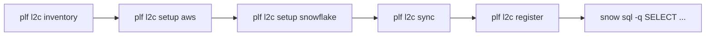

Or as a single command: `plf l2c migrate --yes`

#### Iteration Loop

Develop locally, sync changes, verify, reset, repeat.

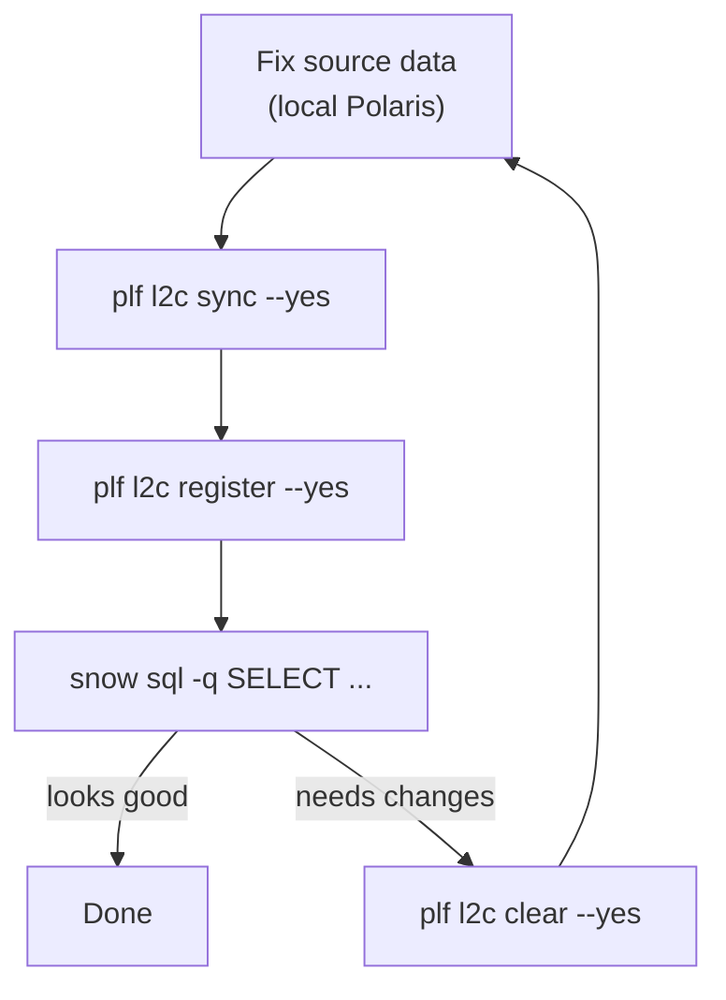

`clear` deletes S3 objects + drops Snowflake tables, resets state to `pending`,
but keeps all infrastructure (bucket, IAM, ext vol, SA_ROLE).

#### Recovery Flow

When sync fails partway through, re-run to resume.

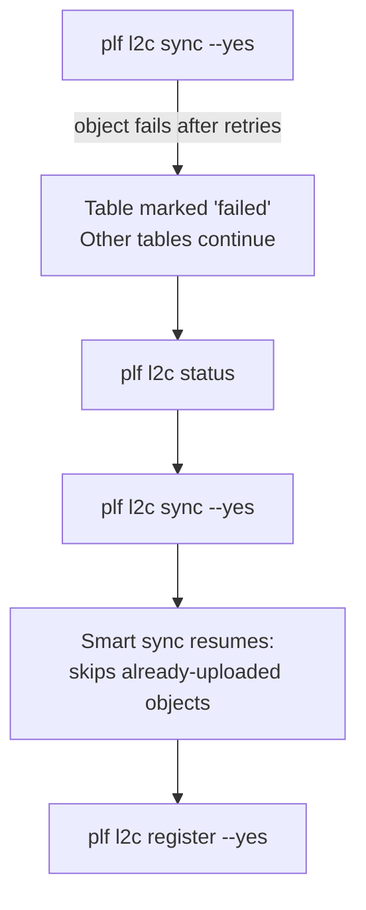

Smart sync compares key+size, so partially-uploaded tables only transfer
the remaining objects on retry.

#### Clear vs Cleanup

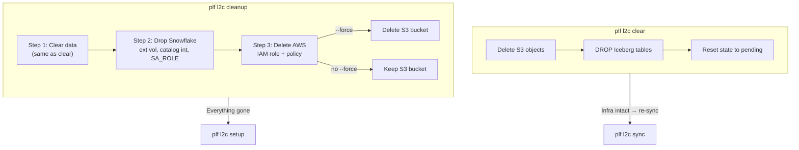

- **clear**: Data reset only. Infrastructure stays. Use for iteration.
- **cleanup**: Full teardown. Use when done with the migration.

#### Cleanup Order

Snowflake resources must be dropped before AWS because the external volume
references the S3 bucket and IAM role.

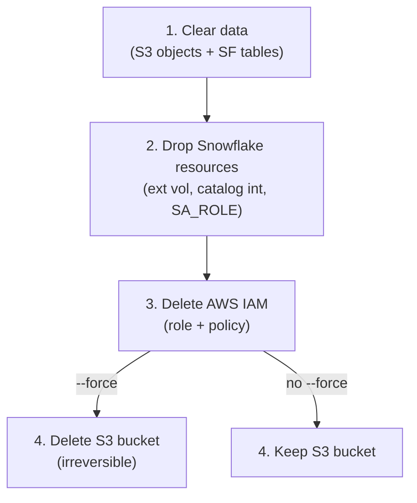

#### Cortex Code Flow

All mutating CLI commands follow the dry-run/approve/execute pattern
for safe agentic operation.

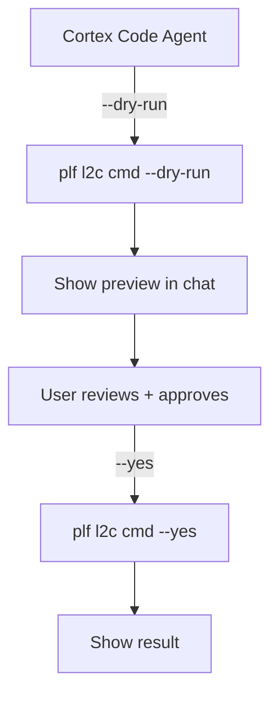

For non-interactive mode, the agent always passes `--admin-role` explicitly
and sets `SNOWFLAKE_DEFAULT_CONNECTION_NAME` in `.env` to avoid interactive prompts.

#### Incremental Data Update (zero downtime)

User mutates penguins locally (adds rows, updates data via DuckDB or Polaris API).
Iceberg creates a new metadata snapshot (e.g., `00002-xxx.metadata.json`).
The Snowflake table still points to the old `00001-xxx.metadata.json`.

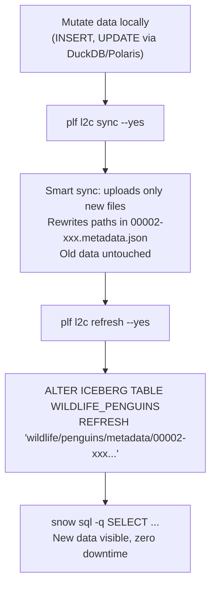

**Key insight:** Iceberg is append-only. New snapshots add files; they don't
delete old ones. Smart sync uploads only the delta. The Snowflake table stays
live throughout -- only the metadata pointer is updated via `ALTER ... REFRESH`.

**Do NOT use `clear` for incremental updates.** `clear` drops the Snowflake
table, causing downtime for any app querying it, and deletes all S3 objects,
forcing a full re-upload. It is only appropriate when you want a complete reset
(see [Iteration Loop](#iteration-loop)).

#### Manual Refresh (legacy)

Before `plf l2c refresh` was implemented, the manual workaround was `snow sql` directly.
This is no longer needed -- use `plf l2c refresh --yes` instead (see
[Incremental Data Update](#incremental-data-update-zero-downtime)).

Legacy manual path:

```mermaid
flowchart TD
    Mutate["Mutate data locally"] --> Sync["plf l2c sync --yes"]
    Sync --> FindMeta["plf l2c status -o json<br/>or check S3 for latest metadata"]
    FindMeta --> Refresh["snow sql -q &quot;ALTER ICEBERG TABLE<br/>DB.SCHEMA.WILDLIFE_PENGUINS<br/>REFRESH 'wildlife/.../00002-xxx.metadata.json'&quot;<br/>--role SA_ROLE"]
    Refresh --> Verify["snow sql -q SELECT ..."]
```

#### New Table Added to Existing Catalog

User adds a new table (e.g., `wildlife.flamingos`) to local Polaris after the
initial migration. Infrastructure already exists.

```mermaid
flowchart LR
    Add["Add table locally<br/>(Polaris API / DuckDB)"] --> Inventory["plf l2c inventory"]
    Inventory --> Sync["plf l2c sync --yes"]
    Sync --> Register["plf l2c register --yes"]
```

No `clear` or `setup` needed. The new table starts at `pending` status and
flows through normally. Existing synced/registered tables are skipped.

#### Mixed: Mutated Data + New Table

Both paths compose naturally. `sync` handles both existing and new tables in
one pass. `refresh` and `register` target different state subsets.

```mermaid
flowchart TD
    Changes["User mutated penguins<br/>AND added flamingos"] --> Sync["plf l2c sync --yes"]
    Sync --> SyncResult["penguins: smart sync (delta only)<br/>flamingos: full upload (new table)"]
    SyncResult --> Refresh["plf l2c refresh --yes"]
    Refresh --> RefreshResult["penguins: ALTER ... REFRESH<br/>(zero downtime, new metadata)<br/>flamingos: skipped (not registered yet)"]
    RefreshResult --> Register["plf l2c register --yes"]
    Register --> RegisterResult["penguins: skipped (already done)<br/>flamingos: CREATE ICEBERG TABLE"]
```

| Command | Targets | State filter |
|---------|---------|-------------|
| `sync` | All tables from inventory | `pending`, `in_progress`, `failed` (or all with `--force`) |
| `refresh` | Already-registered tables | `register.status == done` |
| `register` | Synced but not yet registered | `sync.status == synced` AND `register.status != done` |

**Taskfile shortcut:** `task l2c:update WORK_DIR=~/polaris-dev -- --force --yes`
runs `sync → refresh → register` in one command. Use `--force` after local
data mutations so sync picks up the delta.

#### Schema Evolution

User changes penguins schema locally (adds a column, changes types).
Iceberg creates a new metadata file with an updated schema.

Same path as incremental data update: sync → refresh. No `clear` needed.
Snowflake re-infers the schema from the new metadata file on `REFRESH`.

```mermaid
flowchart LR
    Evolve["ALTER TABLE locally<br/>(add/drop column)"] --> Sync["sync"]
    Sync --> Refresh["refresh<br/>(or ALTER ... REFRESH)"]
    Refresh --> Verify["Schema auto-inferred<br/>from new metadata"]
```

#### When to Use `clear`

`clear` is the **nuclear option** -- use it only when you want a complete reset,
not for incremental updates.

| Scenario | Use `clear`? | Better path |
|----------|:---:|-------------|
| Added rows locally | No | sync → refresh |
| Changed schema locally | No | sync → refresh |
| Want to start from scratch | **Yes** | clear → sync → register |
| Source data is corrupted / wrong | **Yes** | clear → fix → sync → register |
| Testing the full pipeline end-to-end | **Yes** | clear → sync → register |

#### Known Gaps

| Gap | Description | Workaround |
|-----|-------------|------------|
| No `--table` filter | `sync`/`clear`/`register`/`refresh` operate on all tables. Cannot target a single table. | Manually edit `l2c-state.json` to reset one table's status to `pending`. |
| No selective clear | `clear` resets all tables, not individual ones. | Edit state file, or use `snow sql` to drop a single SF table manually. |

#### State Lifecycle

```mermaid
stateDiagram-v2
    [*] --> pending: sync discovers table
    pending --> in_progress: sync starts
    in_progress --> synced: sync completes + rewrite
    in_progress --> failed: object transfer fails
    failed --> in_progress: re-run sync
    synced --> done: register succeeds
    done --> done: refresh updates metadata_path
    synced --> pending: clear resets
    done --> pending: clear resets
    failed --> pending: clear resets
```

Each table tracks two independent state machines: `sync` (pending → in_progress →
synced/failed) and `register` (pending → done/failed). The `refresh` command
updates `metadata_path` and `refreshed_at` within the `done` state (no state
transition -- the table stays registered). The `clear` command resets both to
`pending`.

---

### L2C Key Design Decisions

#### 1. Catalog integration + METADATA_FILE_PATH

Snowflake External Iceberg Tables are registered using a **catalog integration**
(`CATALOG_SOURCE=OBJECT_STORE`, `TABLE_FORMAT=ICEBERG`) with `METADATA_FILE_PATH`
pointing to the latest Iceberg metadata JSON file.

**Alternative considered:** `CATALOG='SNOWFLAKE'` with explicit column definitions.

**Why this approach:**
- Schema inference: Snowflake reads the Iceberg metadata and infers the schema
  automatically. No need to maintain Python type-mapping logic.
- Read-only: the external table is read-only, which is the intended use case for
  migrated PoC data.
- Simpler code: no column type mapping, no pyiceberg `Schema` → Snowflake DDL conversion.

#### 2. Dual boto3 sessions with env scrub

The project directory `.env` sets `AWS_ACCESS_KEY_ID=admin`, `AWS_SECRET_ACCESS_KEY=password`,
and `AWS_ENDPOINT_URL=http://localhost:19000` for RustFS. These would contaminate any
boto3 session that reads from environment variables.

**Solution:** Two completely isolated sessions:
- `create_rustfs_session()`: Explicit credentials from config dict. Never reads env vars.
- `create_cloud_session()`: Uses `boto3.Session(profile_name=...)`. Must be called
  inside `scrubbed_aws_env()` context manager which temporarily strips all `AWS_*`
  vars from `os.environ`.

The `_clean_aws_env()` helper builds a clean env dict for `subprocess.run()` calls
(used by the preflight AWS check and region resolution).

#### 3. Manifest + JSON state file (dual tracking)

- **Manifest** (`.snow-utils/snow-utils-manifest.md`): Human-readable markdown with
  resource tables. Updated by `setup snowflake`. Used for audit, replay, and
  compatibility with the existing `snow-utils` pattern.
- **State file** (`.snow-utils/l2c-state.json`): Machine-readable JSON with AWS/Snowflake
  config and per-table sync/register status. Used by all L2C commands for operational
  decision-making (what to sync, what to register, what to clear).

The `status` command performs **drift detection** between `aws.sf_base` and
`snowflake.sf_base` to catch naming inconsistencies from prefix changes.

#### 4. Smart sync with exponential backoff

Default sync mode compares key+size between RustFS and AWS S3. Only new or
size-changed objects are transferred. This is efficient for Iceberg's append-heavy
pattern where subsequent syncs only transfer new data/metadata files.

Per-object retry: 3 attempts with exponential backoff (1s, 2s, 4s). Per-table
failure isolation: a failed table is marked `failed` in state but sync continues
for remaining tables.

#### 5. Iceberg metadata path rewriter

Iceberg metadata files contain absolute S3 paths to data files, manifest lists,
and manifests. After migrating from `s3://polardb/` to `s3://kameshs-polaris-dev-polardb/`,
these paths must be rewritten for Snowflake to read the data.

**Implementation:** Pure Python rewriter using `json` (for metadata.json) and
`fastavro` (for Avro manifest lists and manifests). Handles all three Iceberg
file types per the spec.

**Alternatives considered:**
- Spark `rewrite-table-path` procedure: requires JVM + Spark setup, too heavy.
- PyIceberg: no native `rewrite_table_path` yet ([#2014](https://github.com/apache/iceberg-python/issues/2014)).

**Deprecation plan:** Replace with PyIceberg's implementation when available.
See [docs/iceberg-metadata-rewrite.md](iceberg-metadata-rewrite.md) for the
full technical decision document.

#### 6. snow-utils reuse

L2C reuses ~907 lines from `snow-utils` and `snow-utils-common`:
- `extvolume.py`: S3 bucket, IAM policy/role, external volume, trust policy
- `discover_snowflake_connection()`: Snowflake CLI connection discovery
- `run_snow_sql_file()`: Jinja-templated SQL execution via `snow sql`

New L2C code is ~2,700 lines (11 Python files + 9 SQL templates).

#### 7. admin_role in manifest only

`admin_role` (ACCOUNTADMIN or equivalent) is needed only during `setup snowflake`
for creating account-level objects. It is stored in the manifest for replay/audit
but **never** in `.env`. This prevents accidental use of elevated privileges in
subsequent commands.

The `SA_ROLE` (least-privilege migration role) is the default for all data operations
(register, clear). It can only create Iceberg tables in the target DB/Schema.

#### 8. Pre-flight AWS check

Before any AWS-mutating operation, `preflight_aws_check()` runs
`aws sts get-caller-identity` as a subprocess with RustFS env vars scrubbed.
This catches expired SSO tokens and missing credentials early, before boto3
sessions are created, with a clear actionable error message.

The check runs only on actual execution (`--yes`), not on `--dry-run`.

#### 9. clear vs cleanup separation

- **clear**: Removes migrated data (S3 objects + Snowflake tables), resets table
  state to `pending`. Infrastructure (bucket, IAM, ext vol, SA_ROLE) stays intact.
  Use for the iteration loop: clear → fix source → sync → register.
- **cleanup**: Full teardown. Drops Snowflake resources first (ext vol references
  bucket), then AWS IAM. S3 bucket only deleted with `--force`.

#### 10. Project-scoped resource naming

All resources follow `<user>-<project>-<catalog>` (AWS, lowercase hyphens) or
`<USER>_<PROJECT>_<CATALOG>` (Snowflake, uppercase underscores). No type suffixes
(`-policy`, `-role`, `-vol`) because each resource type lives in its own namespace.

Example for user `kameshs`, project `polaris-dev`, catalog `polardb`:

| Resource | Name |
|----------|------|
| S3 bucket | `kameshs-polaris-dev-polardb` |
| IAM policy | `kameshs-polaris-dev-polardb` |
| IAM role | `kameshs-polaris-dev-polardb` |
| External volume | `KAMESHS_POLARIS_DEV_POLARDB` |
| Catalog integration | `KAMESHS_POLARIS_DEV_POLARDB` |
| SA_ROLE | `KAMESHS_POLARIS_DEV_POLARDB` |
| Database | `KAMESHS_POLARIS_DEV_POLARDB` |

`--prefix` overrides the user portion; `--no-prefix` drops it entirely.

#### 11. Zero-downtime refresh via ALTER ICEBERG TABLE

After local data mutations, Iceberg creates a new metadata snapshot (e.g.,
`00002-xxx.metadata.json`). The Snowflake table still points at the old snapshot.

`plf l2c refresh` runs `ALTER ICEBERG TABLE ... REFRESH '<new-metadata-path>'`
to repoint the table without `DROP`ing it. This is zero-downtime: applications
querying the table are unaffected during the switch.

**How it works:**

1. Reads state, filters tables with `register.status == done`
2. Calls `find_latest_metadata()` on the destination S3 bucket
3. Compares with the stored `register.metadata_path`
4. If a newer version exists, executes `ALTER ICEBERG TABLE ... REFRESH`
5. Updates state with new `metadata_path` and `refreshed_at`

**Why `--force` is needed on `sync`:** After a local mutation, the table's sync
status is still `synced` from the first migration. Without `--force`, `sync`
skips it. `--force` makes sync re-compare all objects (smart sync still only
uploads the delta).

**SQL template** (`refresh_table.sql`):

```sql
ALTER ICEBERG TABLE {{table_name}} REFRESH '{{metadata_file_path}}';
```

---

### Edge Cases and Limitations

> Legend: **Implemented** = handled in code, **Manual** = user workaround,
> **Known gap** = no mitigation yet.

| # | Edge Case | Behavior | Mitigation | Status |
|---|-----------|----------|------------|--------|
| 1 | `refresh` when no tables are registered | Prints "No registered tables to refresh" and exits | Run `register` first | **Implemented** (`refresh.py`) |
| 2 | `sync` without `--force` after local mutation | Skips table (already `synced`) | Use `--force` to re-upload delta | **Implemented** (`sync.py --force`) |
| 3 | Concurrent L2C runs (no state file lock) | Last writer wins, potential state corruption | Single-user tool; no file locking implemented | **Known gap** |
| 4 | `--prefix` changed between `setup` and `sync` | Drift: bucket name mismatch | `status` command warns via drift detection | **Implemented** (`orchestrators.py` drift check) |
| 5 | Metadata version gap (00001, 00003, no 00002) | `find_latest_metadata` picks highest (00003) | Correct behavior per Iceberg spec | **Implemented** (`common.py find_latest_metadata`) |
| 6 | Schema evolution (column add/drop) + refresh | Snowflake re-infers schema from new metadata | Works; but DROP COLUMN may break existing queries | **Implemented** (inherent Snowflake behavior) |
| 7 | `refresh` after `clear` | No registered tables (all reset to `pending`) | Correct: refresh skips, re-run `register` | **Implemented** (flows from #1) |
| 8 | RustFS down during `sync` | Per-table failure with retry (3 attempts, exponential backoff) | Re-run `sync` after RustFS recovers (smart sync resumes) | **Implemented** (`sync.py` per-object retry) |
| 9 | AWS SSO expired mid-sync | Fails at preflight check or mid-transfer | Re-authenticate, re-run sync (smart sync resumes) | **Implemented** (`common.py preflight_aws_check`) |
| 10 | Table deleted from local Polaris | State still has it as `synced`; future sync discovers from inventory and ignores stale state | Edit state file manually or run `clear` | **Manual** workaround; no stale-state auto-detection |
| 11 | pyiceberg >= 0.11.0 vs local Polaris | `RestCatalog` init fails with `PUT is not a valid HttpMethod` | Install pyiceberg from git main until 0.11.1 ships ([#3010](https://github.com/apache/iceberg-python/pull/3010)) | **Manual** workaround; upstream fix pending |
| 12 | `--no-prefix` vs `--prefix` on different commands | Resources named inconsistently | Use consistent flags; `status` drift detection warns | **Implemented** (same drift check as #4) |
| 13 | S3 objects deleted outside L2C | `refresh`/`register` succeed if metadata still valid | If data files are missing, Snowflake queries fail at read time | **Known gap**; no proactive S3 integrity check |
