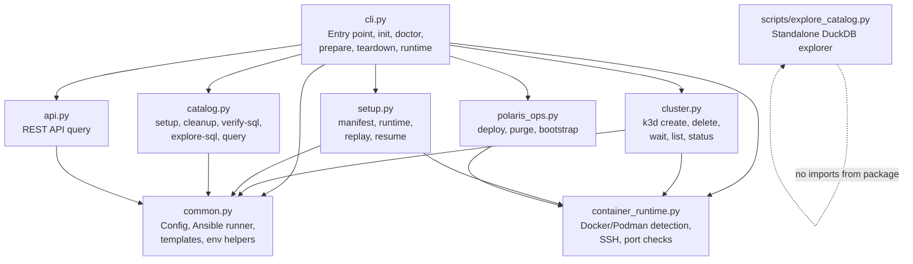
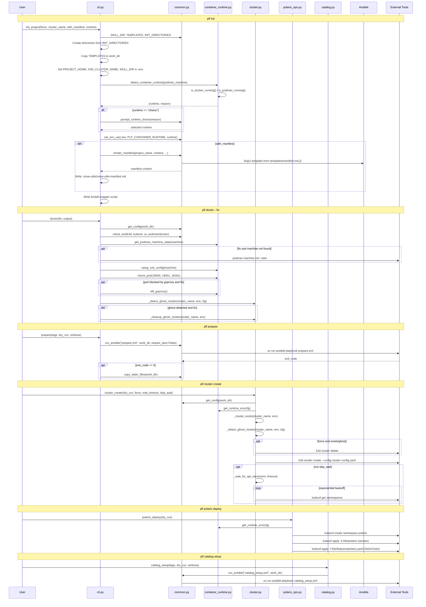
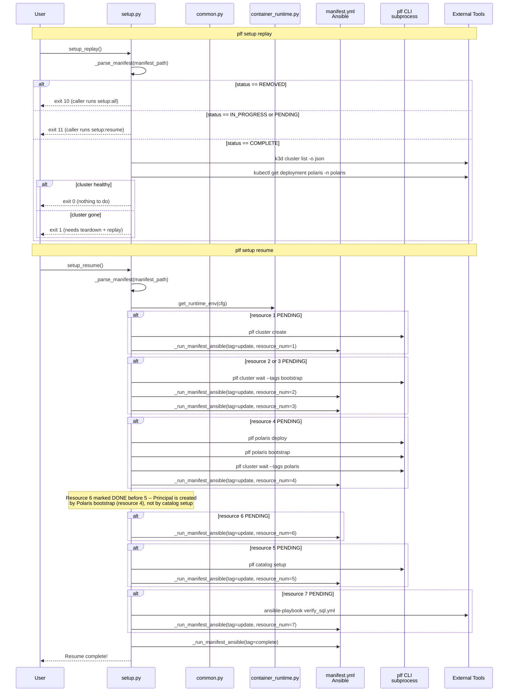
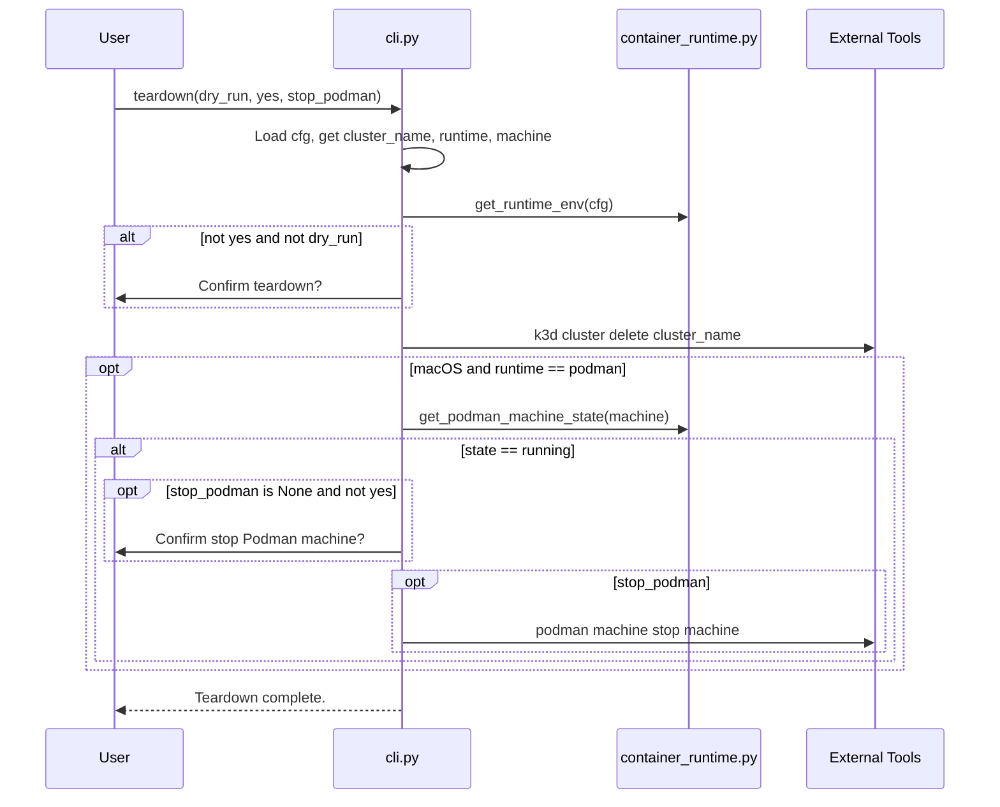
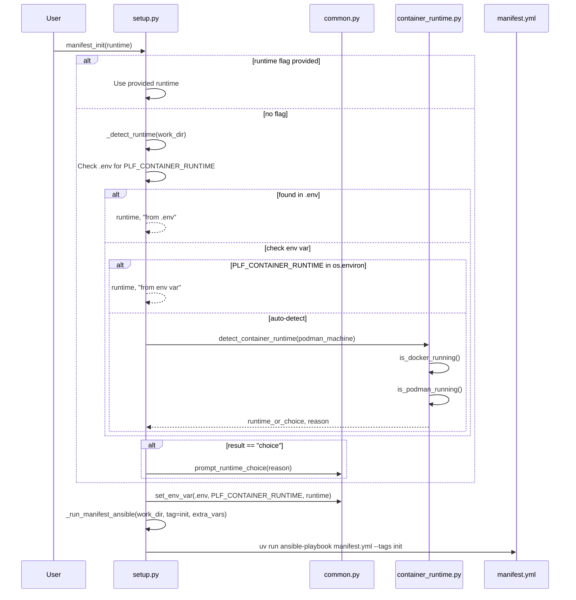

# Polaris Local Forge -- CLI Design Document

> Generated from codebase analysis of `src/polaris_local_forge/` (11 files, ~3,368 lines).
> Last updated: 2026-02-25

---

## Table of Contents

1. [Module Dependency Graph](#module-dependency-graph)
2. [CLI Command Tree](#cli-command-tree)
3. [Sequence Diagrams](#sequence-diagrams)
   - [Full Setup Workflow](#1-full-setup-workflow)
   - [Setup Replay/Resume Orchestration](#2-setup-replayresume-orchestration)
   - [Teardown Workflow](#3-teardown-workflow)
   - [Manifest Init + Runtime Detection](#4-manifest-init--runtime-detection)
   - [API Query and Catalog Query Flows](#5-api-query-and-catalog-query-flows)
4. [Key Design Decisions](#key-design-decisions)

---

## Module Dependency Graph

Each Python module has a single responsibility. Shared utilities live in `common.py`;
container runtime abstraction lives in `container_runtime.py`. All other modules are
leaf command groups registered on the root Click group in `cli.py`.



**Import rules:**
- `common.py` and `container_runtime.py` never import from other package modules.
- `cli.py` is the only module that registers command groups (`add_command`).
- `cluster.py` has one lazy import back to `cli.py` (`init_project`) inside `cluster_create()` to break a circular dependency.

---

## CLI Command Tree

All commands are accessed via the `polaris-local-forge` entry point (aliased as `plf` by the generated wrapper script).

```
plf [--work-dir PATH]
├── init                          # cli.py:init_project
│   ├── --force / -f
│   ├── --cluster-name / -n
│   ├── --with-manifest / -m
│   └── --runtime / -r [docker|podman]
├── doctor                        # cli.py:doctor
│   ├── --fix
│   └── --output [text|json]
├── prepare                       # cli.py:prepare
│   ├── --tags / -t
│   ├── --dry-run / -n
│   └── --verbose / -v
├── teardown                      # cli.py:teardown
│   ├── --dry-run / -n
│   ├── --yes / -y
│   └── --stop-podman / --no-stop-podman
├── runtime                       # cli.py (group)
│   ├── docker-host               # cli.py:runtime_docker_host
│   └── detect                    # cli.py:runtime_detect
│       └── --json
├── cluster                       # cluster.py (group)
│   ├── create                    # cluster.py:cluster_create
│   │   ├── --dry-run / -n
│   │   ├── --force / -f
│   │   ├── --wait-timeout INT
│   │   └── --skip-wait
│   ├── delete                    # cluster.py:cluster_delete
│   │   ├── --dry-run / -n
│   │   └── --yes / -y
│   ├── wait                      # cluster.py:cluster_wait
│   │   ├── --tags / -t
│   │   ├── --dry-run / -n
│   │   └── --verbose / -v
│   ├── list                      # cluster.py:cluster_list
│   │   └── --output [text|json]
│   └── status                    # cluster.py:cluster_status
│       └── --output [text|json]
├── polaris                       # polaris_ops.py (group)
│   ├── deploy                    # polaris_ops.py:polaris_deploy
│   │   └── --dry-run / -n
│   ├── purge                     # polaris_ops.py:polaris_purge
│   │   └── --dry-run / -n
│   └── bootstrap                 # polaris_ops.py:polaris_bootstrap
│       └── --dry-run / -n
├── catalog                       # catalog.py (group)
│   ├── setup                     # catalog.py:catalog_setup
│   │   ├── --tags / -t
│   │   ├── --dry-run / -n
│   │   └── --verbose / -v
│   ├── cleanup                   # catalog.py:catalog_cleanup
│   │   ├── --tags / -t
│   │   ├── --dry-run / -n
│   │   ├── --verbose / -v
│   │   └── --yes / -y
│   ├── verify-sql                # catalog.py:catalog_verify_sql
│   ├── explore-sql               # catalog.py:catalog_explore_sql
│   └── query                     # catalog.py:catalog_query
│       └── --sql / -s TEXT
├── api                           # api.py (group)
│   └── query ENDPOINT            # api.py:api_query
│       ├── --output [json|text]
│       └── --verbose / -v
└── setup                         # setup.py (group)
    ├── manifest                  # setup.py (subgroup)
    │   ├── init                  # setup.py:manifest_init
    │   │   └── --runtime [docker|podman]
    │   ├── status                # setup.py:manifest_status
    │   │   └── --json
    │   ├── update RESOURCE_NUM   # setup.py:manifest_update
    │   ├── start                 # setup.py:manifest_start
    │   ├── complete              # setup.py:manifest_complete
    │   └── remove                # setup.py:manifest_remove
    ├── runtime                   # setup.py (subgroup)
    │   ├── ensure                # setup.py:runtime_ensure
    │   └── stop                  # setup.py:runtime_stop
    ├── replay                    # setup.py:setup_replay
    └── resume                    # setup.py:setup_resume
```

**Total: 28 commands** across 7 modules.

---

## Sequence Diagrams

### 1. Full Setup Workflow

The canonical happy-path from a bare directory to a running Polaris environment.
Each `plf` command is a separate user invocation; the SKILL.md orchestration layer
(or Taskfile) calls them in sequence.



**Key observations:**

- `init` is self-contained: creates directories, copies templates, detects runtime, writes `.env`. No subprocess calls to external tools.
- `doctor` is the only command that attempts auto-remediation (`--fix`). It checks tools, Podman machine state, port availability, and ghost clusters.
- `prepare` delegates entirely to Ansible (`prepare.yml`) which generates k8s manifests, `.aws/config`, and SQL scripts from Jinja2 templates.
- `cluster create` does pre-flight validation (existing cluster, ghost cluster) before invoking `k3d`, then waits for the API server with exponential backoff.
- `polaris deploy` is a 3-step kubectl sequence: namespace, secrets (kustomize), HelmChart.
- `catalog setup` delegates to Ansible (`catalog_setup.yml`) which creates the Polaris catalog, namespaces, and demo data via the Polaris REST API.

### 2. Setup Replay/Resume Orchestration

The `setup replay` and `setup resume` commands provide idempotent setup.
`replay` inspects manifest state and returns an exit code; the caller (Taskfile)
decides whether to run `setup:all` (exit 10) or `setup:resume` (exit 11).
`resume` walks through resources 1-7, skipping any already marked DONE.



**Resource numbering:**

| # | Resource   | Created by          | Wait strategy             |
|---|-----------|---------------------|---------------------------|
| 1 | k3d cluster | `plf cluster create` | API server readiness loop |
| 2 | RustFS     | k3d volume mount    | `cluster wait --tags bootstrap` |
| 3 | PostgreSQL | k3d volume mount    | `cluster wait --tags bootstrap` |
| 4 | Polaris    | `plf polaris deploy` + `bootstrap` | `cluster wait --tags polaris` |
| 5 | Catalog    | `plf catalog setup` | Ansible playbook completes |
| 6 | Principal  | Polaris bootstrap job | Already done after resource 4 |
| 7 | Demo data  | `verify_sql.yml`    | Ansible playbook completes |

**Why resource 6 before 5:** The principal (OAuth2 client credentials) is created by the
Polaris bootstrap job (resource 4). By the time resource 4 is DONE, the principal already
exists. Resource 6 is simply a manifest bookkeeping step. Resource 5 (catalog setup) then
uses those credentials to configure namespaces and demo data.

### 3. Teardown Workflow

Teardown is intentionally simple: delete the k3d cluster (which wipes all in-cluster
state including RustFS, PostgreSQL, and Polaris), then optionally stop the Podman machine.



**Design note:** No explicit catalog cleanup is performed. The k3d cluster deletion
removes all containers, volumes, and networks associated with the cluster. This is
faster and more reliable than running cleanup playbooks against services that may be
in an inconsistent state.

### 4. Manifest Init + Runtime Detection

Runtime detection has a 3-tier priority: explicit `--runtime` flag, `.env` file,
environment variable, then auto-detection. The `_detect_runtime()` helper in `setup.py`
adds `.env` reading on top of the lower-level `detect_container_runtime()` from
`container_runtime.py`.



**Auto-detection logic in `detect_container_runtime()`:**

```
1. Docker running AND Podman running  ->  "docker" (prefer Docker)
2. Docker running only                ->  "docker"
3. Podman running only                ->  "podman"
4. Neither running, both installed    ->  "choice" (prompt user)
5. Neither running, one installed     ->  that one
6. Neither installed                  ->  None (error)
```

### 5. API Query and Catalog Query Flows

Two different query paths exist: `plf api query` goes through Ansible for REST API
calls, while `plf catalog query` invokes DuckDB directly for SQL against Iceberg tables.

```mermaid
sequenceDiagram
    participant User
    participant API as api.py
    participant Catalog as catalog.py
    participant Common as common.py
    participant Subprocess as External Tools

    Note over User,Subprocess: plf api query /api/management/v1/catalogs
    User->>API: api_query(endpoint, output, verbose)
    API->>API: Validate endpoint starts with /
    API->>API: Check work/principal.txt exists
    API->>Subprocess: uv run ansible-playbook api_query.yml -e endpoint=...
    alt verbose
        Subprocess-->>User: Raw Ansible output
    else
        API->>API: Regex extract "result.json" from stdout
        API->>API: Parse JSON
        alt output == json
            API-->>User: Pretty-printed JSON
        else
            API->>API: _print_text(data)
            API-->>User: Flattened key-value text
        end
    end

    Note over User,Subprocess: plf catalog query --sql "SELECT ..."
    User->>Catalog: catalog_query(sql)
    Catalog->>Catalog: load_dotenv(.env)
    Catalog->>Catalog: Parse work/principal.txt -> realm, client_id, client_secret
    Catalog->>Catalog: Build setup SQL: INSTALL iceberg, CREATE SECRET, ATTACH
    Catalog->>Subprocess: duckdb -c "setup_sql + user_sql;"
    Subprocess-->>User: Query results
```

**Why two query mechanisms:**

- `plf api query` is for Polaris REST API introspection (management endpoints, catalog
  metadata). It delegates to Ansible because the `api_query.yml` playbook handles OAuth2
  token acquisition and HTTP request construction.
- `plf catalog query` is for SQL-based data access against Iceberg tables. It uses DuckDB's
  native Iceberg extension which handles OAuth2 internally via the `CREATE SECRET` statement.

---

## Key Design Decisions

### 1. subprocess.run over Python libraries

The CLI uses `subprocess.run` for all external tool interaction (k3d, kubectl, podman,
duckdb, ansible-playbook) rather than Python client libraries.

**Rationale:**
- k3d has no Python SDK; kubectl has a Python client but it adds complexity for operations
  that are simpler as shell commands (apply -f, apply -k, create namespace).
- Ansible is invoked via `uv run ansible-playbook` to ensure dependency isolation --
  ansible and its plugins run in the uv-managed virtual environment.
- DuckDB CLI is used for `catalog query` / `verify-sql` / `explore-sql` because it
  provides a familiar interactive experience and handles extension loading automatically.

**Trade-off:** Error messages from failed subprocesses can be opaque. The CLI mitigates
this by capturing stderr and providing contextual error messages where possible.

### 2. Ansible for configuration and catalog operations

Template rendering (`prepare`), catalog setup/cleanup, and API queries are delegated
to Ansible playbooks rather than implemented in Python.

**Rationale:**
- Ansible's Jinja2 templating + variable layering (defaults, env vars, extra vars)
  provides a declarative configuration pipeline.
- `kubernetes.core` Ansible modules provide idempotent k8s resource management.
- The `uri` module in Ansible handles HTTP requests with retry/backoff for Polaris API
  calls during catalog setup.

**Trade-off:** Ansible adds startup latency (~2-3s per playbook invocation) and requires
users to have ansible installed as a dev dependency.

### 3. SKILL_DIR / work_dir split

The source code (SKILL_DIR) and the user's project directory (work_dir) are kept separate.

```
SKILL_DIR (source repo)              work_dir (user project)
├── src/polaris_local_forge/         ├── .env
├── polaris-forge-setup/             ├── .kube/config
│   ├── defaults/main.yml            ├── .aws/config
│   ├── templates/                   ├── k8s/
│   └── *.yml playbooks              ├── work/principal.txt
├── config/cluster-config.yaml       ├── scripts/explore_catalog.sql
└── k8s/ (static files)              └── bin/plf
```

**Rationale:**
- Users can have multiple project directories sharing the same SKILL_DIR.
- The source repo is never modified by CLI operations (read-only after install).
- `plf init` copies templates and static files from SKILL_DIR to work_dir.
- `run_ansible()` always passes `-e plf_output_base={work_dir}` to ensure Ansible
  writes generated files to the project directory, not the source directory.

**Guard:** `init_project()` and `doctor()` check `work_dir.resolve() == SKILL_DIR.resolve()`
and refuse to operate on the source directory.

### 4. Container runtime abstraction

The CLI supports both Docker and Podman as container runtimes. The abstraction layer
in `container_runtime.py` handles:

- **Detection:** Check what's installed and running, prompt if ambiguous.
- **DOCKER_HOST:** On macOS with Podman, k3d needs an SSH-based DOCKER_HOST pointing
  to the Podman VM (not the local Unix socket). `get_runtime_env()` sets this.
- **SSH config:** Podman VMs on macOS require SSH key configuration for k3d to
  communicate with the VM. `setup_ssh_config()` handles this.

The runtime choice is persisted to `.env` as `PLF_CONTAINER_RUNTIME` so subsequent
commands don't need to re-detect.

### 5. Manifest-driven orchestration

The `.snow-utils/snow-utils-manifest.md` file tracks setup progress as a markdown
document with a resource table. Each resource (1-7) has a status (PENDING/DONE).

**Rationale:**
- Human-readable: users can inspect progress by reading the file.
- Idempotent resume: `setup resume` checks each resource's status and skips completed ones.
- Cross-workflow: both the CLI (`plf setup`) and Taskfile (`task setup:all`) can read
  and update the same manifest.
- Ansible integration: `manifest.yml` playbook handles atomic updates to the markdown
  using regex replacements.

**Trade-off:** Regex-based markdown parsing is fragile. The `_parse_manifest()` function
relies on specific formatting patterns that could break if the template changes.
