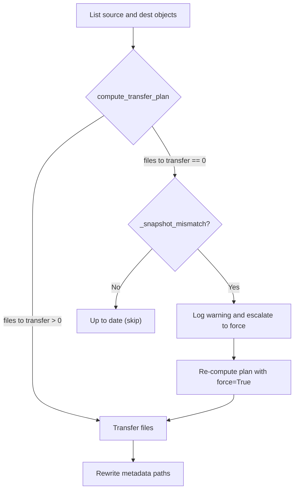

# Smart Sync: Key+Size Comparison and Snapshot-Aware Fallback

> Technical reference for `plf l2c sync` transfer logic.
> Source: [`sync.py`](../src/polaris_local_forge/l2c/sync.py)

## Overview

`plf l2c sync` copies Iceberg table data from local RustFS to AWS S3.
The default **smart sync** mode minimises data transfer by comparing object
keys and sizes between source and destination.  When key+size comparison
misses a genuine change (e.g. after a local mutation that replaces a Parquet
file with one of identical size), a **snapshot-aware fallback** detects the
mismatch using Iceberg metadata and auto-escalates to a full re-upload.

## Key+Size Comparison

### What is a "key"?

A key is the full S3 object path relative to the bucket root.  For a table
`wildlife.penguins` the objects look like:

```
wildlife/penguins/metadata/00000-<uuid>.metadata.json
wildlife/penguins/metadata/snap-<id>-<uuid>.avro
wildlife/penguins/data/<uuid>.parquet
```

### Transfer plan algorithm

```
_compute_transfer_plan(src_objects, dst_objects, force):
    if force:
        return all source keys
    return keys where:
        key is NOT in dst_objects          (new file)
        OR dst_objects[key].size != size   (size changed)
```

A key present in both source and destination with the same byte count is
considered "already synced" and skipped.

### When key+size comparison works well

| Scenario | Why it works |
|----------|-------------|
| Initial sync (empty S3) | Every key is new |
| Append-only writes | New Parquet + metadata files have unique UUIDs |
| Re-run after interrupted sync | Missing keys are detected automatically |

### When key+size comparison fails

| Scenario | Why it fails |
|----------|-------------|
| Local mutation (delete/update) | PyIceberg creates new data files with new UUIDs, but old S3 files with different UUIDs are not detected as stale |
| Demo reset (drop+recreate table) | New table_uuid, new snapshots, potentially same key names if UUID collision (rare) or same file count |
| Metadata rewrite changes sizes | After rewrite, S3 metadata files have different sizes than RustFS originals -- this actually *helps* on subsequent syncs |

The core problem: key+size is **file-level** comparison.  It cannot detect
that the *table* has logically changed when the individual file keys/sizes
happen to match or when S3 contains stale files that no longer appear in
the source.

## Metadata Path Rewriting Side-Effect

After sync, `rewrite_table_paths()` updates Iceberg metadata on S3 to
replace `s3://<rustfs-bucket>/` prefixes with `s3://<aws-bucket>/`.  This
changes the byte size of metadata files on S3, so on the *next* sync the
metadata keys will show a size mismatch and be re-transferred.  Data
(Parquet) and manifest (Avro) files are unaffected.

## Snapshot-Aware Fallback

When smart sync reports zero files to transfer, `_snapshot_mismatch()`
downloads and parses the latest `metadata.json` from both RustFS and S3
using PyIceberg's `TableMetadataUtil` (spec-compliant Pydantic model).

### Comparison fields

| Field | What it tells us |
|-------|-----------------|
| `table_uuid` | Identity of the table -- differs after drop+recreate (demo reset) |
| `current_snapshot_id` | Current data version -- differs after any mutation (insert, delete, update) |

If either field differs, sync auto-escalates to `--force` for that table.

### Flowchart



### Finding the latest metadata key

Iceberg metadata files follow the naming convention:

```
<prefix>/metadata/<version>-<uuid>.metadata.json
```

`_find_latest_metadata_key()` extracts the integer `<version>` via regex
and returns the key with the highest version number.

### Safety

- If either side has no metadata file, the check is skipped (returns False).
- If downloading or parsing fails, the check is skipped with a warning.
- The fallback only escalates from "no transfer" to "force all"; it never
  reduces transfers.
- Idempotent: running sync twice after escalation will show "up to date" on
  the second run (snapshots now match).

## Scenario Walkthroughs

### 1. Initial sync (clean S3)

1. `dst_objects` is empty.
2. All source keys are new -- full transfer.
3. Metadata rewritten on S3.
4. State updated to "synced".

### 2. Idempotent re-run (no local changes)

1. `dst_objects` has all keys; sizes differ for metadata (rewrite effect).
2. Metadata files re-transferred (size mismatch); data files skipped.
3. Metadata rewritten again (idempotent).

### 3. Local mutation (e.g. delete Chinstrap penguins)

1. PyIceberg creates new data file + new snapshot + new metadata version.
2. Smart sync detects new keys (new data file, new metadata file) -- transfers them.
3. If keys happen to collide (unlikely with UUIDs), `_snapshot_mismatch` catches the change via `current_snapshot_id`.

### 4. Demo reset (drop table, reload from scratch)

1. `plf l2c clear --yes` resets state; S3 files may still exist.
2. New table has new `table_uuid`.
3. Smart sync may see matching keys (same Parquet loaded from seed data).
4. `_snapshot_mismatch` detects `table_uuid` difference -- escalates to force.
5. All files re-uploaded; metadata rewritten.

### 5. Force sync (`--force`)

1. Bypasses all comparison logic.
2. All source keys uploaded unconditionally.
3. Metadata rewritten.
