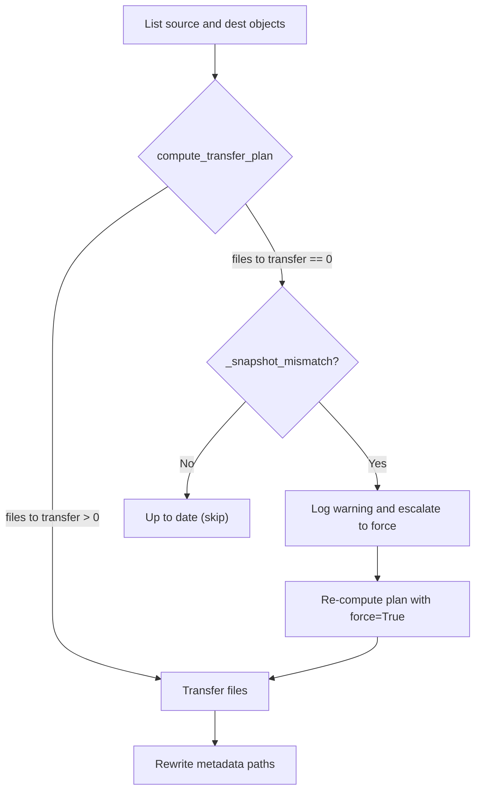

# Smart Sync: Key+Size Comparison and Snapshot-Aware Fallback

> Technical reference for `plf l2c sync` transfer logic.
> Source: [`sync.py`](../src/polaris_local_forge/l2c/sync.py)

## Overview

`plf l2c sync` copies Iceberg table data from local RustFS to AWS S3.
The default **smart sync** mode minimises data transfer by comparing object
keys and sizes between source and destination.  When key+size comparison
misses a genuine change (e.g. after a local mutation that replaces a Parquet
file with one of identical size), a **snapshot-aware fallback** detects the
mismatch using Iceberg metadata and auto-escalates to a full re-upload.

## Key+Size Comparison

### What is a "key"?

A key is the full S3 object path relative to the bucket root.  For a table
`wildlife.penguins` the objects look like:

```
wildlife/penguins/metadata/00000-<uuid>.metadata.json
wildlife/penguins/metadata/snap-<id>-<uuid>.avro
wildlife/penguins/data/<uuid>.parquet
```

### Transfer plan algorithm

```
_compute_transfer_plan(src_objects, dst_objects, force):
    if force:
        return all source keys
    return keys where:
        key is NOT in dst_objects          (new file)
        OR dst_objects[key].size != size   (size changed)
```

A key present in both source and destination with the same byte count is
considered "already synced" and skipped.

### When key+size comparison works well

| Scenario | Why it works |
|----------|-------------|
| Initial sync (empty S3) | Every key is new |
| Append-only writes | New Parquet + metadata files have unique UUIDs |
| Re-run after interrupted sync | Missing keys are detected automatically |

### When key+size comparison fails

| Scenario | Why it fails |
|----------|-------------|
| Local mutation (delete/update) | PyIceberg creates new data files with new UUIDs, but old S3 files with different UUIDs are not detected as stale |
| Demo reset (drop+recreate table) | New table_uuid, new snapshots, potentially same key names if UUID collision (rare) or same file count |
| Metadata rewrite changes sizes | After rewrite, S3 metadata files have different sizes than RustFS originals -- this actually *helps* on subsequent syncs |

The core problem: key+size is **file-level** comparison.  It cannot detect
that the *table* has logically changed when the individual file keys/sizes
happen to match or when S3 contains stale files that no longer appear in
the source.

## Metadata Path Rewriting Side-Effect

After sync, `rewrite_table_paths()` updates Iceberg metadata on S3 to
replace `s3://<rustfs-bucket>/` prefixes with `s3://<aws-bucket>/`.  This
changes the byte size of metadata files on S3, so on the *next* sync the
metadata keys will show a size mismatch and be re-transferred.  Data
(Parquet) and manifest (Avro) files are unaffected.

## Snapshot-Aware Fallback

When smart sync reports zero files to transfer, `_snapshot_mismatch()`
downloads and parses the latest `metadata.json` from both RustFS and S3
using PyIceberg's `TableMetadataUtil` (spec-compliant Pydantic model).

### Comparison fields

| Field | What it tells us |
|-------|-----------------|
| `table_uuid` | Identity of the table -- differs after drop+recreate (demo reset) |
| `current_snapshot_id` | Current data version -- differs after any mutation (insert, delete, update) |

If either field differs, sync auto-escalates to `--force` for that table.

### Flowchart



### Finding the latest metadata key

Iceberg metadata files follow the naming convention:

```
<prefix>/metadata/<version>-<uuid>.metadata.json
```

There are two implementations, each suited to its context:

**`_find_latest_metadata_key()` (sync.py -- in-memory)**

Used within the sync pipeline to compare source (RustFS) and destination
(S3) metadata.  Operates on `dict[str, int]` (key -> size) with no
timestamp data.  Returns the key with the highest version number.

This is safe because: (a) the local RustFS source is always clean after a
rebuild -- no stale files, (b) for the destination, even if it picks a
stale key, the `table_uuid` / `current_snapshot_id` comparison detects
the mismatch and triggers a re-sync.

**`find_latest_metadata()` (common.py -- cloud S3)**

Used by `register`, `refresh`, and `rewrite` commands that operate on
cloud S3 where stale metadata files accumulate after rebuilds.

#### The staleness problem

After a cluster rebuild + fresh sync, S3 contains both old and new
metadata files:

```
00005-abc123.metadata.json   S3 LastModified: 2026-02-28  (old sync)
00001-def456.metadata.json   S3 LastModified: 2026-03-02  (fresh sync)
```

Selecting by version number alone picks `00005` (stale).  Iceberg does
not eagerly garbage-collect old metadata files -- they persist until
expiry policies run.

#### Timestamp-aware selection

`find_latest_metadata()` sorts candidates by
`(S3 LastModified, version_number)` descending.  S3 timestamp is the
primary sort key; version number is the tiebreaker for files uploaded in
the same sync batch.

| Scenario | Result |
|----------|--------|
| Normal operation | Timestamps and version numbers increment together -- same result as version-only sort |
| Post-rebuild | Fresh `00001` (newest timestamp) beats stale `00005` (old timestamp) |
| Same-batch uploads | Multiple files from one sync have near-identical timestamps; version number breaks the tie correctly |

#### Verification via Iceberg `last-updated-ms`

After selecting the winner, one `GetObject` downloads the metadata JSON
to read the Iceberg-intrinsic `last-updated-ms` field (required by the
Iceberg spec in all format versions).  This is logged at `DEBUG` level
for observability alongside the S3 `LastModified` timestamp.

If the runner-up has a strictly newer S3 timestamp than the winner (which
should never happen by sort construction), a `WARNING` is logged.  This
guards against future regressions in the sort logic.

#### Timezone safety

All S3 timestamps are normalized to `datetime.timezone.utc` via
`.astimezone()` before any comparison.  boto3 returns `LastModified` as
a timezone-aware `datetime` with `dateutil.tz.tzutc()`, and the Iceberg
`last-updated-ms` is converted with `datetime.fromtimestamp(ms/1000,
tz=timezone.utc)`.  Normalizing both to the same `tzinfo` object
eliminates any cross-timezone comparison issues.

#### Complementary: `CREATE OR REPLACE` in registration

`register_table.sql` uses `CREATE OR REPLACE ICEBERG TABLE` (not
`IF NOT EXISTS`) so that re-registration always updates the Snowflake
metadata pointer.  Combined with timestamp-aware selection, this ensures
that after a rebuild the correct fresh metadata is selected *and* applied.

#### Register status reset on re-sync

When sync completes successfully, `sync.py` resets the table's register
status to `"pending"` so the register step picks it up again.  Previously,
a stale `"done"` status from a prior run caused the register gate to
skip re-synced tables.

### Safety

- If either side has no metadata file, the check is skipped (returns False).
- If downloading or parsing fails, the check is skipped with a warning.
- The fallback only escalates from "no transfer" to "force all"; it never
  reduces transfers.
- Idempotent: running sync twice after escalation will show "up to date" on
  the second run (snapshots now match).

## Scenario Walkthroughs

### 1. Initial sync (clean S3)

1. `dst_objects` is empty.
2. All source keys are new -- full transfer.
3. Metadata rewritten on S3.
4. State updated to "synced".

### 2. Idempotent re-run (no local changes)

1. `dst_objects` has all keys; sizes differ for metadata (rewrite effect).
2. Metadata files re-transferred (size mismatch); data files skipped.
3. Metadata rewritten again (idempotent).

### 3. Local mutation (e.g. delete Chinstrap penguins)

1. PyIceberg creates new data file + new snapshot + new metadata version.
2. Smart sync detects new keys (new data file, new metadata file) -- transfers them.
3. If keys happen to collide (unlikely with UUIDs), `_snapshot_mismatch` catches the change via `current_snapshot_id`.

### 4. Demo reset (drop table, reload from scratch)

1. `plf l2c clear --yes` resets state; S3 files may still exist.
2. New table has new `table_uuid`.
3. Smart sync may see matching keys (same Parquet loaded from seed data).
4. `_snapshot_mismatch` detects `table_uuid` difference -- escalates to force.
5. All files re-uploaded; metadata rewritten.

### 5. Force sync (`--force`)

1. Bypasses all comparison logic.
2. All source keys uploaded unconditionally.
3. Metadata rewritten.

### 6. Post-rebuild stale metadata

1. User tears down local cluster + catalog, rebuilds from scratch.
2. `plf l2c sync` uploads fresh data.  New `00001-<uuid>.metadata.json`
   lands in S3 with a recent `LastModified` timestamp.
3. Old `00005-<uuid>.metadata.json` from the previous sync remains in S3
   with an older `LastModified` timestamp (Iceberg GC has not run).
4. `find_latest_metadata()` sorts by `(LastModified, version_number)` and
   picks `00001` (newest S3 timestamp) over stale `00005`.
5. `register_table.sql` runs `CREATE OR REPLACE ICEBERG TABLE` with the
   fresh metadata path.
6. Registration succeeds; Snowflake points at current data.
